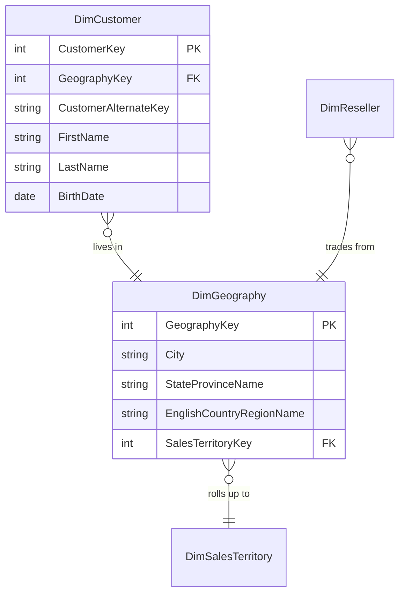

# Customer

## Description
The second snowflake chain, and the one that matters more: geography is normalised out of the customer dimension because the reseller dimension needs exactly the same table. A city and its country belong to neither context, so folding them into `DimCustomer` would mean maintaining a second copy inside `DimReseller` and watching the two disagree.

This context also took a stale copy of the calendar, which it should not have.

## Proposed Snowflake Schema

### Dimension Tables

1. **`DimCustomer`**
   One row per customer, pointing out at geography.
   - **Grain**: One row per customer.
   - **Columns**: `CustomerKey`, `GeographyKey`, `CustomerAlternateKey`, `FirstName`, `LastName`, `BirthDate`, `MaritalStatus`, `Gender`, `YearlyIncome`, `EnglishEducation`, `EnglishOccupation`

2. **`DimGeography`**
   The shared outrigger, used by customers and resellers alike, and itself pointing up at territory.
   - **Grain**: One row per city.
   - **Columns**: `GeographyKey`, `City`, `StateProvinceCode`, `StateProvinceName`, `CountryRegionCode`, `EnglishCountryRegionName`, `PostalCode`, `SalesTerritoryKey`

3. **`DimDate`**
   A stale local copy of the kernel's calendar. Deprecated.
   - **Grain**: One row per calendar day, as this context sees it.
   - **Columns**: `DateKey`, `FullDateAlternateKey`, `CalendarYear`, `CalendarQuarter`, `CohortMonth`

## Snowflake Schema Diagram

## Lineage

| Proposed Table | Source Model(s) |
| :--- | :--- |
| `DimCustomer` | `adventureworks.stg_customer`, `adventureworks.stg_person` |
| `DimGeography` | `adventureworks.stg_address` |
| `DimDate` | `adventureworks.dim_date_generated` |

The table list and lineage above are generated from the per-table documents in
this directory. If they disagree with a child document, the child is authoritative.
