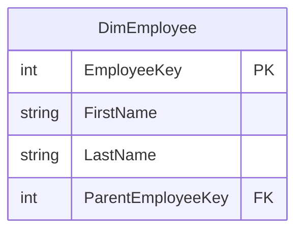

# Human Resources

## Description
The employee dimension, and the sales-person hierarchy that hangs off it. On the context map because `FactResellerSales` and `FactSalesQuota` both already carry an `EmployeeKey`, but nothing here has been modelled: AdventureWorks' employee table is a `hierarchyid` tree and flattening it into a dimension is its own decision, not a mechanical one.

## Proposed Snowflake Schema

### Dimension Tables

Nothing yet. `DimEmployee` is the first table this context will need, and two facts already reference it.

## Snowflake Schema Diagram

