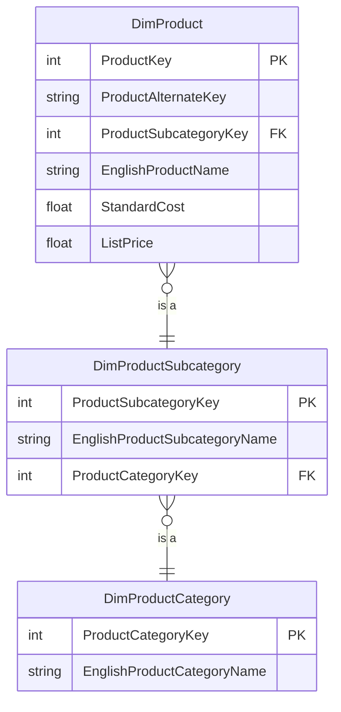

# Product

## Description
The chain the word snowflake was coined for. `DimProduct` does not carry its category name: it carries a subcategory key, the subcategory carries a category key, and the category carries the name. Three tables and two joins to answer "what category is this", where a flat star would have answered it with no joins at all.

The trade is deliberate. AdventureWorks has 606 products, 37 subcategories and 4 categories, so folding the names in would repeat four strings across six hundred rows -- which costs nothing in storage and everything in maintenance, because renaming a category then means rewriting six hundred rows and hoping none were missed.

## Proposed Snowflake Schema

### Dimension Tables

1. **`DimProduct`**
   The product dimension, the base of the chain.
   - **Grain**: One row per product per set of tracked attributes.
   - **Columns**: `ProductKey`, `ProductAlternateKey`, `ProductSubcategoryKey`, `EnglishProductName`, `StandardCost`, `ListPrice`, `Color`, `Size`, `Weight`, `ModelName`, `Status`

2. **`DimProductSubcategory`**
   First outrigger: one row per subcategory, pointing at a category.
   - **Grain**: One row per product subcategory.
   - **Columns**: `ProductSubcategoryKey`, `ProductSubcategoryAlternateKey`, `EnglishProductSubcategoryName`, `ProductCategoryKey`

3. **`DimProductCategory`**
   Second outrigger: the top of the chain. Four rows.
   - **Grain**: One row per product category.
   - **Columns**: `ProductCategoryKey`, `ProductCategoryAlternateKey`, `EnglishProductCategoryName`

## Snowflake Schema Diagram

## Lineage

| Proposed Table | Source Model(s) |
| :--- | :--- |
| `DimProduct` | `adventureworks.stg_product` |
| `DimProductSubcategory` | `adventureworks.stg_productsubcategory` |
| `DimProductCategory` | `adventureworks.stg_productcategory` |

The table list and lineage above are generated from the per-table documents in
this directory. If they disagree with a child document, the child is authoritative.
