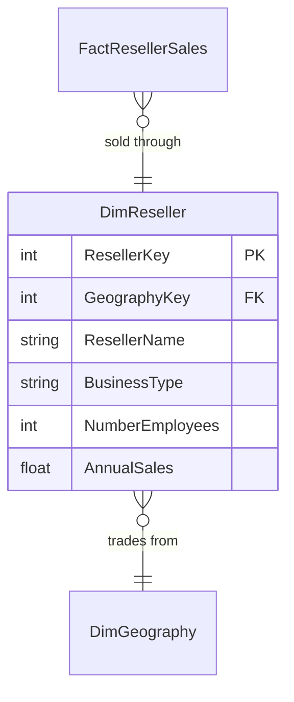

# Reseller

## Description
One dimension, and the reason `DimGeography` exists as a table of its own. A reseller has a location in exactly the same sense a customer does, and the moment two dimensions need the same attribute the question stops being whether to normalise and becomes where to put the shared copy.

## Proposed Snowflake Schema

### Dimension Tables

1. **`DimReseller`**
   One row per reseller, sharing the customer context's geography outrigger.
   - **Grain**: One row per reseller.
   - **Columns**: `ResellerKey`, `GeographyKey`, `ResellerAlternateKey`, `ResellerName`, `BusinessType`, `NumberEmployees`, `AnnualSales`, `YearOpened`

## Snowflake Schema Diagram

## Lineage

| Proposed Table | Source Model(s) |
| :--- | :--- |
| `DimReseller` | `adventureworks.stg_store` |

The table list and lineage above are generated from the per-table documents in
this directory. If they disagree with a child document, the child is authoritative.
