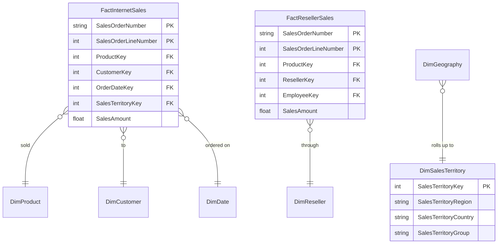

# Sales

## Description
The two fact tables, and the territory dimension both of them share. AdventureWorks keeps internet and reseller sales apart because they have different grains and different dimensionality -- a reseller sale has an employee and a reseller, an internet sale has neither -- and merging them into one fact with half its columns null is the mistake this split exists to avoid.

## Proposed Snowflake Schema

### Fact Table(s)

1. **`FactInternetSales`**
   Direct-to-customer sales, one row per order line.
   - **Grain**: One row per sales order line.
   - **Columns**: `SalesOrderNumber`, `SalesOrderLineNumber`, `ProductKey`, `CustomerKey`, `OrderDateKey`, `SalesTerritoryKey`, `OrderQuantity`, `UnitPrice`, `SalesAmount`, `TotalProductCost`, `TaxAmt`, `Freight`

2. **`FactResellerSales`**
   Sales through resellers, one row per order line.
   - **Grain**: One row per sales order line.
   - **Columns**: `SalesOrderNumber`, `SalesOrderLineNumber`, `ProductKey`, `ResellerKey`, `EmployeeKey`, `OrderDateKey`, `SalesTerritoryKey`, `OrderQuantity`, `UnitPrice`, `SalesAmount`, `TotalProductCost`

3. **`FactSalesQuota`**
   Quarterly sales quota by employee. Written before the employee dimension existed.
   - **Grain**: One row per employee per quarter.
   - **Columns**: `EmployeeKey`, `CalendarYear`, `CalendarQuarter`, `SalesAmountQuota`

### Dimension Tables

1. **`DimSalesTerritory`**
   The territory both facts roll up to, and the top of the geography chain.
   - **Grain**: One row per sales territory.
   - **Columns**: `SalesTerritoryKey`, `SalesTerritoryAlternateKey`, `SalesTerritoryRegion`, `SalesTerritoryCountry`, `SalesTerritoryGroup`

## Snowflake Schema Diagram

## Lineage

| Proposed Table | Source Model(s) |
| :--- | :--- |
| `FactInternetSales` | `adventureworks.stg_salesorderdetail`, `adventureworks.stg_salesorderheader` |
| `FactResellerSales` | `adventureworks.stg_salesorderdetail`, `adventureworks.stg_salesorderheader` |
| `FactSalesQuota` | `adventureworks.stg_salesperson` |
| `DimSalesTerritory` | `adventureworks.stg_salesterritory` |

The table list and lineage above are generated from the per-table documents in
this directory. If they disagree with a child document, the child is authoritative.
