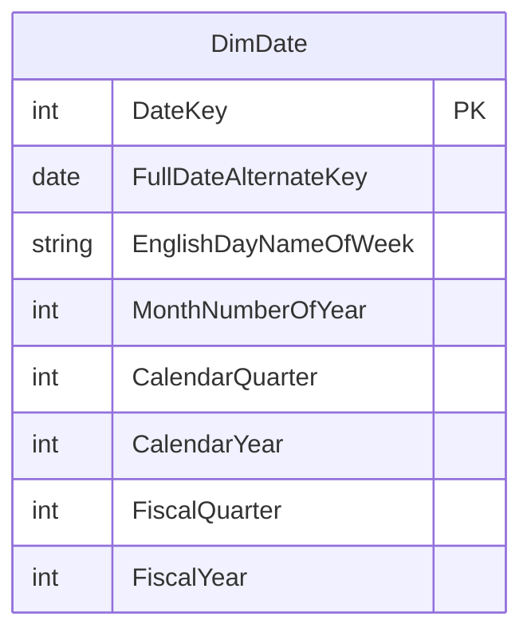

# Shared Kernel

## Description
The calendar, shared by both fact tables and by nothing else. AdventureWorks ships `DimDate` with three parallel calendars on it -- calendar, fiscal and a named-day set -- and all three stay here rather than being split, because a date dimension that has to be joined twice to answer one question is worse than a wide one.

## Proposed Schema

### Dimension Tables

1. **`DimDate`**
   The conformed calendar. The authority for `DateKey`.
   - **Grain**: One row per calendar day.
   - **Columns**: `DateKey`, `FullDateAlternateKey`, `EnglishDayNameOfWeek`, `MonthNumberOfYear`, `EnglishMonthName`, `CalendarQuarter`, `CalendarYear`, `FiscalQuarter`, `FiscalYear`

## Snowflake Schema Diagram

## Lineage

| Proposed Table | Source Model(s) |
| :--- | :--- |
| `DimDate` | `adventureworks.dim_date_generated` |

The table list and lineage above are generated from the per-table documents in
this directory. If they disagree with a child document, the child is authoritative.
