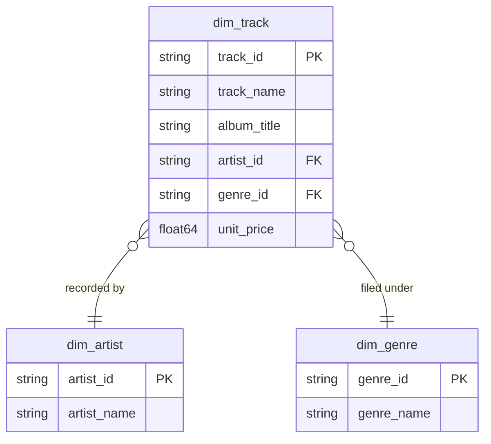

# Catalog [JP] カタログ

## Description
The Catalog context owns what is for sale: the track, who recorded it, and what kind of music it is. Nothing here knows that a track was ever sold — Sales borrows these dimensions across the boundary and never the other way round. [JP] カタログコンテキストは販売対象そのもの、つまり楽曲、その演奏者、そして音楽のジャンルを所有します。ここでは楽曲が販売されたことを一切関知しません。販売コンテキストが境界を越えてこれらのディメンションを参照するだけで、その逆はありません。

## Proposed Star Schema

### Dimension Tables

1. **`dim_track`**
   The track as it appears in the store, with its album and its price. [JP] ストアに並ぶ楽曲そのもの。アルバムと価格を伴います。
   - **Grain**: One row per track. [JP] 楽曲ごとに 1 行。
   - **Columns**: `track_id`, `track_name`, `album_title`, `artist_id`, `genre_id`, `media_type`, `milliseconds`, `unit_price`

2. **`dim_artist`**
   The recording artist. [JP] 録音アーティスト。
   - **Grain**: One row per artist. [JP] アーティストごとに 1 行。
   - **Columns**: `artist_id`, `artist_name`

3. **`dim_genre`**
   The genre a track is filed under. [JP] 楽曲が分類されるジャンル。
   - **Grain**: One row per genre. [JP] ジャンルごとに 1 行。
   - **Columns**: `genre_id`, `genre_name`

## Star Schema Diagram

## Lineage

| Proposed Table | Source Model(s) |
| :--- | :--- |
| `dim_track` | `chinook.stg_tracks`, `chinook.stg_albums` |
| `dim_artist` | `chinook.stg_artists` |
| `dim_genre` | `chinook.stg_genres` |

The table list and lineage above are generated from the per-table documents in this directory. If they disagree with a child document, the child is authoritative.
