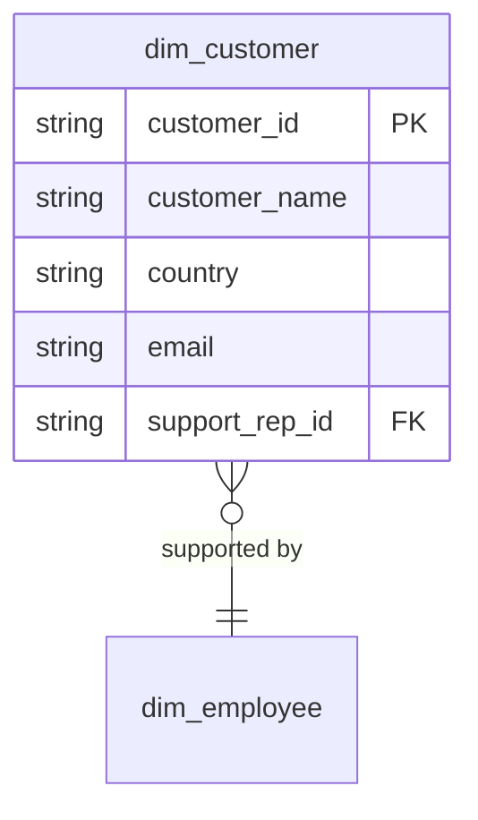

# Customer [JP] 顧客

## Description
The Customer context owns who is buying: the account, where it bills to, and which support representative looks after it. [JP] 顧客コンテキストは購入者を所有します。アカウント、請求先、そして担当するサポート担当者です。

## Proposed Star Schema

### Dimension Tables

1. **`dim_customer`**
   The buying account. [JP] 購入アカウント。
   - **Grain**: One row per customer. [JP] 顧客ごとに 1 行。
   - **Columns**: `customer_id`, `customer_name`, `country`, `city`, `email`, `support_rep_id`

## Star Schema Diagram

## Lineage

| Proposed Table | Source Model(s) |
| :--- | :--- |
| `dim_customer` | `chinook.stg_customers` |

The table list and lineage above are generated from the per-table documents in this directory. If they disagree with a child document, the child is authoritative.
