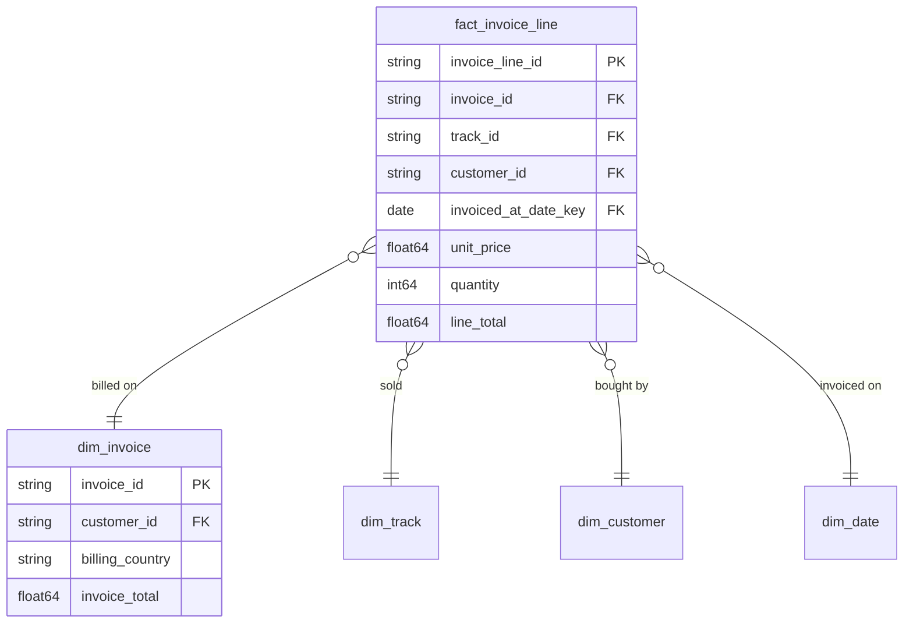

# Sales [JP] 販売

## Description
The Sales context owns the transaction: which track was bought, on which invoice, by whom, and what it was actually charged. Every dimension it reads is owned elsewhere — the catalogue by Catalog, the buyer by Customer, the calendar by the Shared Kernel. [JP] 販売コンテキストは取引そのものを所有します。どの楽曲が、どの請求書で、誰によって購入され、実際にいくら請求されたかです。参照するディメンションはすべて他コンテキストの所有物で、カタログはカタログコンテキスト、購入者は顧客コンテキスト、暦は共有カーネルが所有します。

## Proposed Star Schema

### Fact Table(s)

1. **`fact_invoice_line`**
   One row per track sold. [JP] 販売された楽曲ごとに 1 行。
   - **Grain**: One row per line on an invoice. [JP] 請求書の明細行ごとに 1 行。
   - **Columns**: `invoice_line_id`, `invoice_id`, `track_id`, `customer_id`, `invoiced_at_date_key`, `promotion_id`, `unit_price`, `quantity`, `line_total`

### Dimension Tables

1. **`dim_invoice`**
   The invoice the line belongs to, kept as a dimension so the billing address can be read without the line. [JP] 明細が属する請求書。請求先住所を明細なしで参照できるよう、ディメンションとして保持します。
   - **Grain**: One row per invoice. [JP] 請求書ごとに 1 行。
   - **Columns**: `invoice_id`, `customer_id`, `billing_country`, `billing_city`, `invoice_total`

## Star Schema Diagram

## Lineage

| Proposed Table | Source Model(s) |
| :--- | :--- |
| `fact_invoice_line` | `chinook.stg_invoice_items`, `chinook.stg_invoices` |
| `dim_invoice` | `chinook.stg_invoices` |

The table list and lineage above are generated from the per-table documents in this directory. If they disagree with a child document, the child is authoritative.
