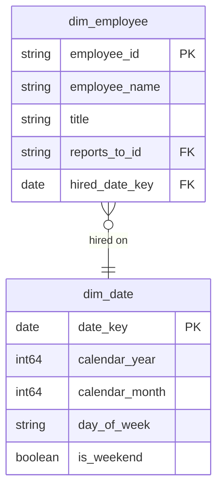

# Shared Kernel [JP] 共有カーネル

## Description
The Shared Kernel owns what every other context borrows and none of them should own: the calendar, and the staff directory the Customer context reads a representative out of. [JP] 共有カーネルは、他のどのコンテキストも参照するが、どのコンテキストも所有すべきでないものを所有します。すなわち暦と、顧客コンテキストが担当者を読み出す従業員名簿です。

## Proposed Star Schema

### Dimension Tables

1. **`dim_date`**
   The calendar, conformed across every context. [JP] 全コンテキストで統一された暦。
   - **Grain**: One row per day. [JP] 1 日ごとに 1 行。
   - **Columns**: `date_key`, `calendar_year`, `calendar_month`, `day_of_week`, `is_weekend`

2. **`dim_employee`**
   The staff directory. [JP] 従業員名簿。
   - **Grain**: One row per employee. [JP] 従業員ごとに 1 行。
   - **Columns**: `employee_id`, `employee_name`, `title`, `reports_to_id`, `hired_date_key`

## Star Schema Diagram

## Lineage

| Proposed Table | Source Model(s) |
| :--- | :--- |
| `dim_date` | `chinook.stg_calendar` |
| `dim_employee` | `chinook.stg_employees` |

The table list and lineage above are generated from the per-table documents in this directory. If they disagree with a child document, the child is authoritative.
