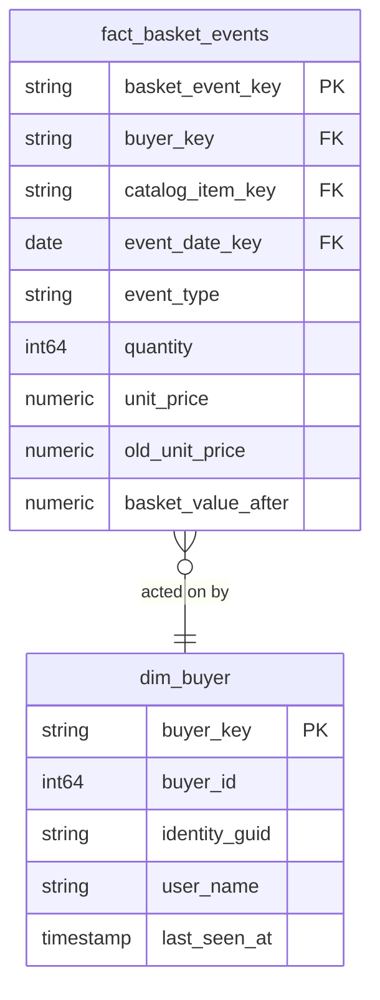

# Basket

## Description
Basket owns what a shopper is considering but has not bought. In eShop this is the thinnest service in the system: a Redis hash keyed by buyer id, holding a list of `BasketItem`, with no relational database and no history at all. The warehouse gets its facts from the events the service publishes rather than from a table, which is why this context's fact is an event stream and not a snapshot.

It also holds a local copy of `dim_buyer`. Basket only ever knows the buyer id on the Redis key, so when the context needed a buyer to join to, it made one from what it had rather than reaching into Identity. That copy has drifted a long way from the authority, which is the honest outcome of a service that genuinely does not know who its shopper is.

## Proposed Star Schema

### Fact Table(s)

1. **`fact_basket_events`**
   One row per basket event published by the service.
   - **Grain**: One row per basket event.
   - **Columns**: `basket_event_key`, `buyer_key`, `catalog_item_key`, `event_date_key`, `event_type`, `quantity`, `unit_price`, `old_unit_price`, `basket_value_after`

### Dimension Tables

1. **`dim_buyer`**
   A local copy of the conformed buyer dimension, holding only what the Redis key carries.
   - **Grain**: One row per buyer seen on a basket.
   - **Columns**: `buyer_key`, `buyer_id`, `identity_guid`, `user_name`, `last_seen_at`

## Star Schema Diagram

## Lineage

| Proposed Table | Source Model(s) |
| :--- | :--- |
| `fact_basket_events` | `basketdb.stg_basket_events` |
| `dim_buyer` | `basketdb.stg_basket_events` |

The table list and lineage above are generated from the per-table documents in this directory. If they disagree with a child document, the child is authoritative.
