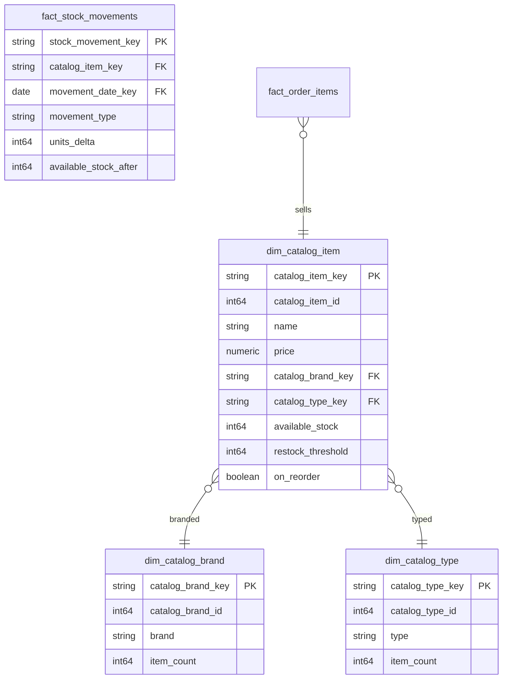

# Catalog

## Description
Catalog owns what is for sale. Its aggregate root is Catalog Item, with Brand and Type as the two dimensions the storefront filters on — in eShop these are real tables (`CatalogBrand`, `CatalogType`) rather than enum columns, and the warehouse keeps them that way. Stock lives here too, because `CatalogItem` is the only thing in eShop that knows how many units exist: `RemoveStock` and `AddStock` are methods on the aggregate, and no other service is allowed to call them.

This context owns everything it reads except the calendar. It is the only context in the model that does.

## Proposed Star Schema

### Fact Table(s)

1. **`fact_stock_movements`**
   One row per change to an item's available stock.
   - **Grain**: One row per item per stock change.
   - **Columns**: `stock_movement_key`, `catalog_item_key`, `movement_date_key`, `movement_type`, `units_delta`, `available_stock_after`, `crossed_restock_threshold`

### Dimension Tables

1. **`dim_catalog_item`**
   The Catalog Item aggregate root: one row per item for sale.
   - **Grain**: One row per catalog item.
   - **Columns**: `catalog_item_key`, `catalog_item_id`, `name`, `description`, `price`, `catalog_brand_key`, `catalog_type_key`, `available_stock`, `restock_threshold`, `max_stock_threshold`, `on_reorder`, `picture_file_name`

2. **`dim_catalog_brand`**
   The brand an item belongs to.
   - **Grain**: One row per brand.
   - **Columns**: `catalog_brand_key`, `catalog_brand_id`, `brand`, `item_count`

3. **`dim_catalog_type`**
   The type an item belongs to.
   - **Grain**: One row per type.
   - **Columns**: `catalog_type_key`, `catalog_type_id`, `type`, `item_count`

## Star Schema Diagram

## Lineage

| Proposed Table | Source Model(s) |
| :--- | :--- |
| `dim_catalog_item` | `catalogdb.stg_catalog_items` |
| `dim_catalog_brand` | `catalogdb.stg_catalog_brands`, `catalogdb.stg_catalog_items` |
| `dim_catalog_type` | `catalogdb.stg_catalog_types`, `catalogdb.stg_catalog_items` |
| `fact_stock_movements` | `catalogdb.stg_stock_changes` |

The table list and lineage above are generated from the per-table documents in this directory. If they disagree with a child document, the child is authoritative.
