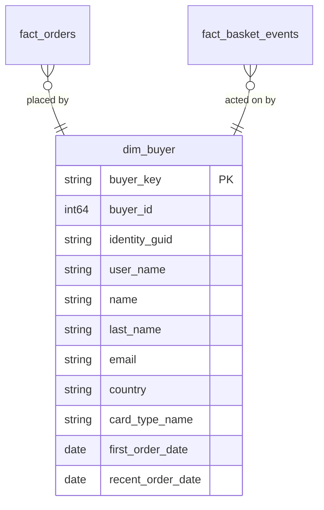

# Identity

## Description
Identity owns who the shopper is. In eShop this is two services holding two halves of one person: `Identity.API` keeps the ASP.NET Core Identity user, with the address and the stored card details a shopper enters at checkout, while the Buyer aggregate inside `Ordering.API` keeps its own record of that same person, linked by `IdentityGuid`. Neither is wrong — Ordering needs a Buyer it can attach a verified `PaymentMethod` to, and it is not allowed to reach into Identity's database to get one.

The warehouse resolves the two into a single conformed `dim_buyer`, which is the only place in this model where a dimension is assembled from two services rather than extracted from one. That makes this context the authority: every other context that says "buyer" means this row.

## Proposed Star Schema

### Fact Table(s)

Identity proposes no fact tables. Registering is an event, but eShop does not publish it to the bus, so the warehouse has no record of it to model.

### Dimension Tables

1. **`dim_buyer`**
   The conformed buyer dimension, assembled from the Identity user and the Ordering Buyer aggregate.
   - **Grain**: One row per buyer.
   - **Columns**: `buyer_key`, `buyer_id`, `identity_guid`, `user_name`, `name`, `last_name`, `email`, `street`, `city`, `state`, `country`, `zip_code`, `card_holder_name`, `card_type_id`, `card_type_name`, `card_expiration`, `first_order_date`, `recent_order_date`

## Star Schema Diagram

## Lineage

| Proposed Table | Source Model(s) |
| :--- | :--- |
| `dim_buyer` | `identitydb.stg_aspnet_users`, `orderingdb.stg_buyers`, `orderingdb.stg_payment_methods`, `orderingdb.stg_orders` |

The table list and lineage above are generated from the per-table documents in this directory. If they disagree with a child document, the child is authoritative.
