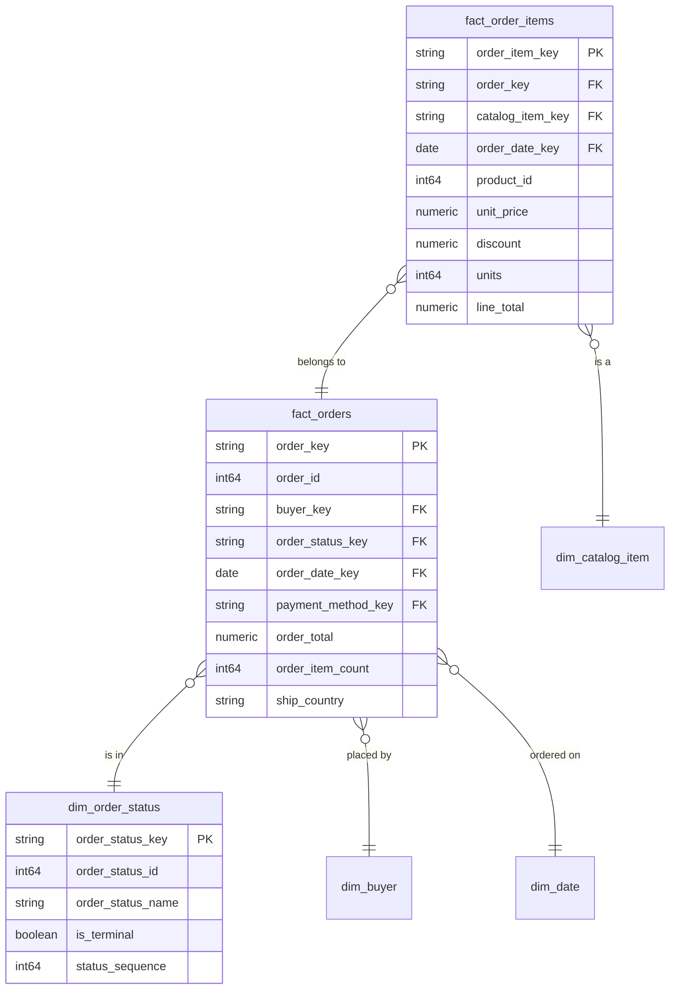

# Ordering

## Description
Ordering owns the transaction. Its aggregate root is Order, and `fact_order_items` is the line-item entity inside that aggregate rather than a fact in its own right — in eShop, `OrderItem` can only be created through `Order.AddOrderItem()`, and nothing outside the aggregate may touch it. The warehouse keeps that boundary: an order item is reachable through its order.

Order Status is modelled as a dimension even though eShop holds it as an enum, because a status has attributes worth carrying — whether it is terminal, where it sits in the lifecycle — and an enum column carries none of them. Buyer and the calendar are borrowed. Payment Method is not borrowed: it belongs to a context that has not been documented, and the reference to it does not resolve.

## Proposed Star Schema

### Fact Table(s)

1. **`fact_orders`**
   The Order aggregate root. One row per order placed.
   - **Grain**: One row per order.
   - **Columns**: `order_key`, `order_id`, `buyer_key`, `order_status_key`, `order_date_key`, `payment_method_key`, `payment_id`, `ship_street`, `ship_city`, `ship_state`, `ship_country`, `ship_zip_code`, `order_total`, `order_item_count`, `distinct_product_count`, `is_draft`, `description`

2. **`fact_order_items`**
   The line items of an order, inside the Order aggregate.
   - **Grain**: One row per product on an order.
   - **Columns**: `order_item_key`, `order_key`, `catalog_item_key`, `order_date_key`, `product_id`, `product_name`, `unit_price`, `discount`, `units`, `line_total`

### Dimension Tables

1. **`dim_order_status`**
   The order lifecycle state, promoted from an enum to a dimension.
   - **Grain**: One row per order status.
   - **Columns**: `order_status_key`, `order_status_id`, `order_status_name`, `is_terminal`, `status_sequence`

## Star Schema Diagram

## Lineage

| Proposed Table | Source Model(s) |
| :--- | :--- |
| `fact_orders` | `orderingdb.stg_orders`, `orderingdb.stg_order_items` |
| `fact_order_items` | `orderingdb.stg_order_items`, `catalogdb.stg_catalog_items` |
| `dim_order_status` | `orderingdb.stg_order_statuses` |

The table list and lineage above are generated from the per-table documents in this directory. If they disagree with a child document, the child is authoritative.
