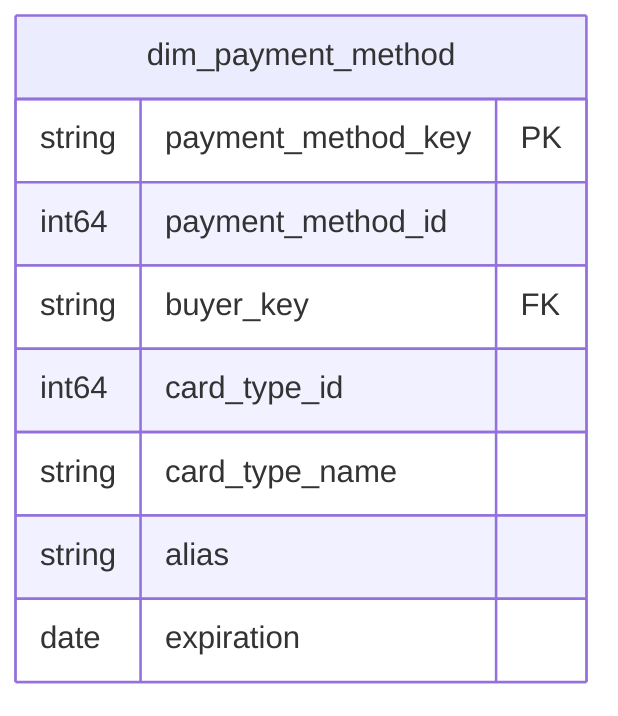

# Payment

## Description
Payment owns taking the money. In eShop this context barely exists: `PaymentProcessor` subscribes to `OrderStatusChangedToStockConfirmedIntegrationEvent`, decides success from a configuration flag, and publishes the result. There is no payment database, no stored transaction, and no service that could tell you what was actually charged.

The context is on the map because Ordering already depends on it — `fact_orders` carries a `payment_method_key`, and eShop's `Order` carries a `PaymentId` — but no table here has been documented, and there is not yet a source that would let one be. Listing the context with nothing behind it says that more honestly than leaving it out would.

## Proposed Star Schema

### Fact Table(s)

None documented yet. `fact_payments`, one row per payment attempt against an order, is the expected first table and needs a source that does not exist yet.

### Dimension Tables

None documented yet. `dim_payment_method` is already referenced by Ordering and does not exist. The data for it is not missing so much as misplaced: `PaymentMethod` is an entity inside the Buyer aggregate in `Ordering.API`, so the payment context would be reading a dimension out of somebody else's database — which is the real reason nobody has written it.

## Star Schema Diagram

## Lineage

| Proposed Table | Source Model(s) |
| :--- | :--- |

Nothing to report until this context has documents.
