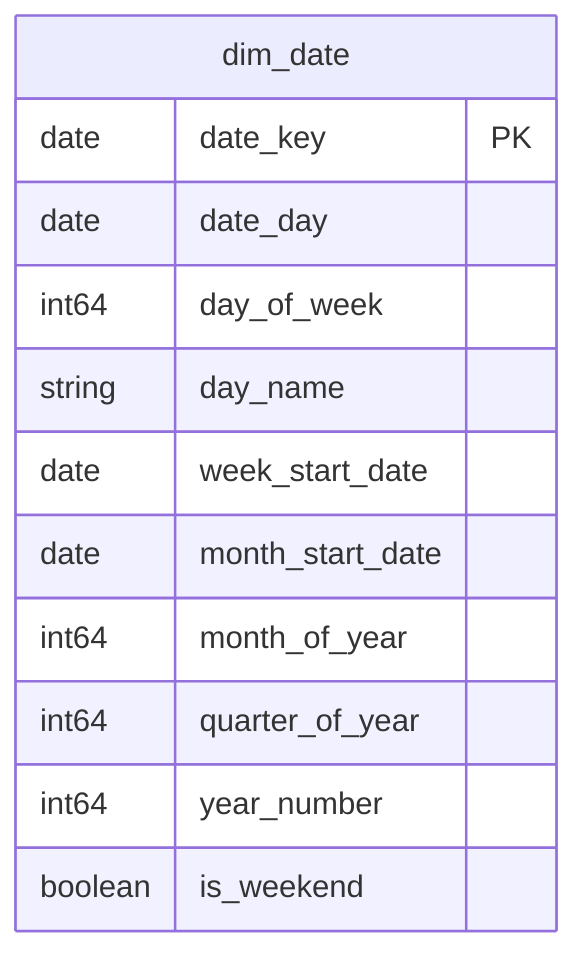

# Shared Kernel (Conformed Dimensions)

## Description
The Shared Kernel is the one bounded context every other context may depend on directly. In eShop itself there is no shared kernel — each microservice owns its own database and the services talk only over the event bus, which is the correct design for the application and useless for analytics. The warehouse has to put something in the middle, and the smallest honest something is a calendar: the one dimension whose meaning genuinely does not vary between Catalog, Ordering and Basket.

Nothing else belongs here. The temptation is to promote `dim_buyer` into the kernel because two contexts hold a copy; the fact that those two copies disagree is the argument against it.

## Proposed Star Schema

### Fact Table(s)

The Shared Kernel proposes no fact tables. A fact records a domain event, and in eShop a domain event is raised inside exactly one service's aggregate.

### Dimension Tables

1. **`dim_date`**
   The conformed calendar dimension. THE date dimension for every context in this model.
   - **Grain**: One row per calendar date.
   - **Columns**: `date_key`, `date_day`, `day_of_week`, `day_name`, `week_start_date`, `month_start_date`, `month_of_year`, `quarter_of_year`, `year_number`, `is_weekend`

## Star Schema Diagram

## Lineage

| Proposed Table | Source Model(s) |
| :--- | :--- |
| `dim_date` | `orderingdb.stg_date_spine` |

The table list and lineage above are generated from the per-table documents in this directory. If they disagree with a child document, the child is authoritative.
