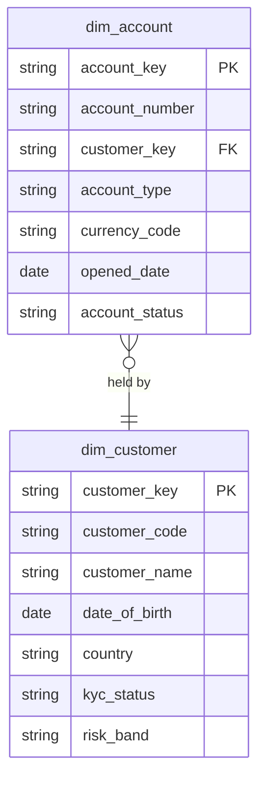

# Customer Identity

## Description
Customer Identity owns who the customer is and what they hold with the bank. Its aggregate root is Customer, and Account is an entity inside that aggregate rather than a thing in its own right: an account has no meaning without the customer it belongs to, and nothing outside this context should reach an account except through its customer. This context is the conformed authority for `dim_customer` — every other context that says "customer" means this one. KYC state lives here too, because the decision that a customer is verified is an identity decision, not a compliance report.

## Proposed Star Schema

### Fact Table(s)

Customer Identity proposes no fact tables. Opening an account is an event Payments and Lending observe; the state that results from it is what this context publishes.

### Dimension Tables

1. **`dim_customer`**
   The Customer aggregate root. The conformed customer dimension for the whole model.
   - **Grain**: One row per customer.
   - **Columns**: `customer_key`, `customer_code`, `customer_name`, `date_of_birth`, `country`, `region`, `postal_code`, `email`, `phone`, `kyc_status`, `kyc_verified_date`, `risk_band`, `first_account_open_date`, `recent_activity_date`

2. **`dim_account`**
   The Account entity inside the Customer aggregate.
   - **Grain**: One row per account.
   - **Columns**: `account_key`, `account_number`, `customer_key`, `account_type`, `currency_code`, `opened_date`, `closed_date`, `account_status`, `overdraft_limit`

## Star Schema Diagram

## Lineage

| Proposed Table | Source Model(s) |
| :--- | :--- |
| `dim_customer` | `core_banking.stg_customer` |
| `dim_account` | `core_banking.stg_account` |

The table list and lineage above are generated from the per-table documents in this directory. If they disagree with a child document, the child is authoritative.
