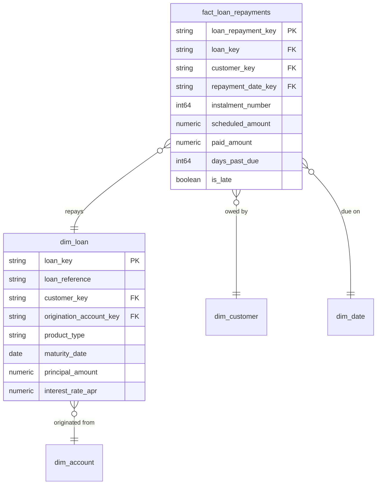

# Lending

## Description
Lending owns credit: what was advanced, on what terms, and what has come back. Its aggregate root is Loan, and `fact_loan_repayments` records the instalments against it. The context borrows Customer and the calendar, and reaches into Customer Identity for the account a loan was originated from — a loan is disbursed to an account and repaid from one, but the account itself is not Lending's to define. Arrears state is derived here and published for Risk & Compliance to read.

## Proposed Star Schema

### Fact Table(s)

1. **`fact_loan_repayments`**
   One row per instalment due on a loan, whether or not it was paid.
   - **Grain**: One row per loan per scheduled instalment.
   - **Columns**: `loan_repayment_key`, `loan_key`, `customer_key`, `repayment_date_key`, `instalment_number`, `scheduled_amount`, `paid_amount`, `principal_component`, `interest_component`, `fees_component`, `days_past_due`, `is_late`, `is_partial`

### Dimension Tables

1. **`dim_loan`**
   The Loan aggregate root, as a dimension: the terms an instalment is measured against.
   - **Grain**: One row per loan.
   - **Columns**: `loan_key`, `loan_reference`, `customer_key`, `origination_account_key`, `product_type`, `origination_date`, `maturity_date`, `principal_amount`, `interest_rate_apr`, `term_months`, `loan_status`

## Star Schema Diagram

## Lineage

| Proposed Table | Source Model(s) |
| :--- | :--- |
| `fact_loan_repayments` | `core_banking.stg_loan_repayment`, `core_banking.stg_loan` |
| `dim_loan` | `core_banking.stg_loan` |

The table list and lineage above are generated from the per-table documents in this directory. If they disagree with a child document, the child is authoritative.
