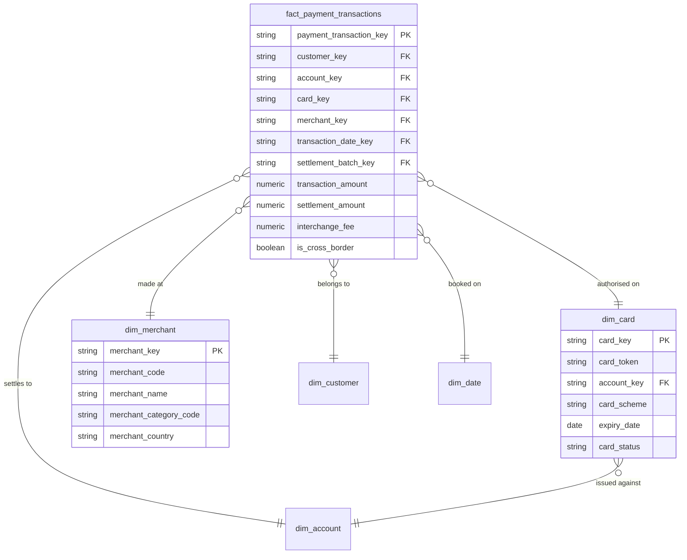

# Payments

## Description
Payments owns the money moving: an authorisation at a merchant, its settlement, and the fees taken out along the way. Its aggregate root is Payment Transaction. Card and Merchant are dimensions this context genuinely owns — a card is a Payments artefact even though it hangs off an account, and a merchant exists only because the bank acquires transactions from it. Customer, Account and the calendar are all borrowed across a boundary, and the settlement batch belongs to Treasury, which has not shipped.

## Proposed Star Schema

### Fact Table(s)

1. **`fact_payment_transactions`**
   The Payment Transaction aggregate root. One row per authorised card transaction.
   - **Grain**: One row per authorised transaction.
   - **Columns**: `payment_transaction_key`, `customer_key`, `account_key`, `card_key`, `merchant_key`, `transaction_date_key`, `settlement_batch_key`, `authorisation_code`, `transaction_type`, `transaction_status`, `transaction_amount`, `transaction_currency_code`, `settlement_amount`, `interchange_fee`, `scheme_fee`, `net_merchant_amount`, `is_cross_border`, `is_card_present`

### Dimension Tables

1. **`dim_card`**
   The card the transaction was authorised on.
   - **Grain**: One row per issued card.
   - **Columns**: `card_key`, `card_token`, `account_key`, `card_scheme`, `card_product`, `issue_date`, `expiry_date`, `card_status`

2. **`dim_merchant`**
   The merchant the transaction was made at.
   - **Grain**: One row per merchant.
   - **Columns**: `merchant_key`, `merchant_code`, `merchant_name`, `merchant_category_code`, `merchant_category_name`, `merchant_country`, `acquirer_name`, `first_transaction_date`, `recent_transaction_date`

## Star Schema Diagram

## Lineage

| Proposed Table | Source Model(s) |
| :--- | :--- |
| `fact_payment_transactions` | `card_network.stg_transaction`, `card_network.stg_settlement` |
| `dim_card` | `card_network.stg_card` |
| `dim_merchant` | `card_network.stg_merchant`, `card_network.stg_transaction` |

The table list and lineage above are generated from the per-table documents in this directory. If they disagree with a child document, the child is authoritative.
