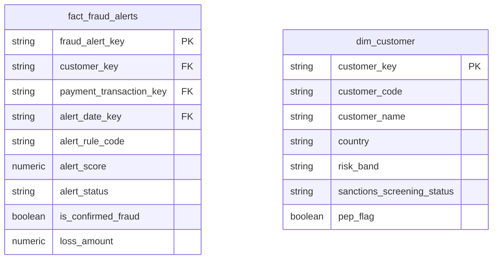

# Risk & Compliance

## Description
Risk & Compliance watches everything the other contexts do and forms its own opinion about it. It owns fraud alerting, sanctions screening and the current risk view of a customer. It is the context most likely to hold a stale copy of somebody else's dimension, because its questions are asked under a deadline and its answers are audited: when Customer Identity's `dim_customer` did not carry sanctions state, this context copied it rather than waiting. That copy is still here, and it has drifted.

## Proposed Star Schema

### Fact Table(s)

1. **`fact_fraud_alerts`**
   One row per alert raised by the fraud engine.
   - **Grain**: One row per alert.
   - **Columns**: `fraud_alert_key`, `customer_key`, `payment_transaction_key`, `alert_date_key`, `alert_rule_code`, `alert_score`, `alert_status`, `is_confirmed_fraud`, `loss_amount`

### Dimension Tables

1. **`dim_customer`**
   A local copy of the conformed customer dimension, carrying the two screening attributes the authority does not.
   - **Grain**: One row per customer.
   - **Columns**: `customer_key`, `customer_code`, `customer_name`, `country`, `risk_band`, `sanctions_screening_status`, `pep_flag`

## Star Schema Diagram

## Lineage

| Proposed Table | Source Model(s) |
| :--- | :--- |
| `fact_fraud_alerts` | `fraud_platform.stg_fraud_alert` |
| `dim_customer` | `core_banking.stg_customer` |

The table list and lineage above are generated from the per-table documents in this directory. If they disagree with a child document, the child is authoritative.
