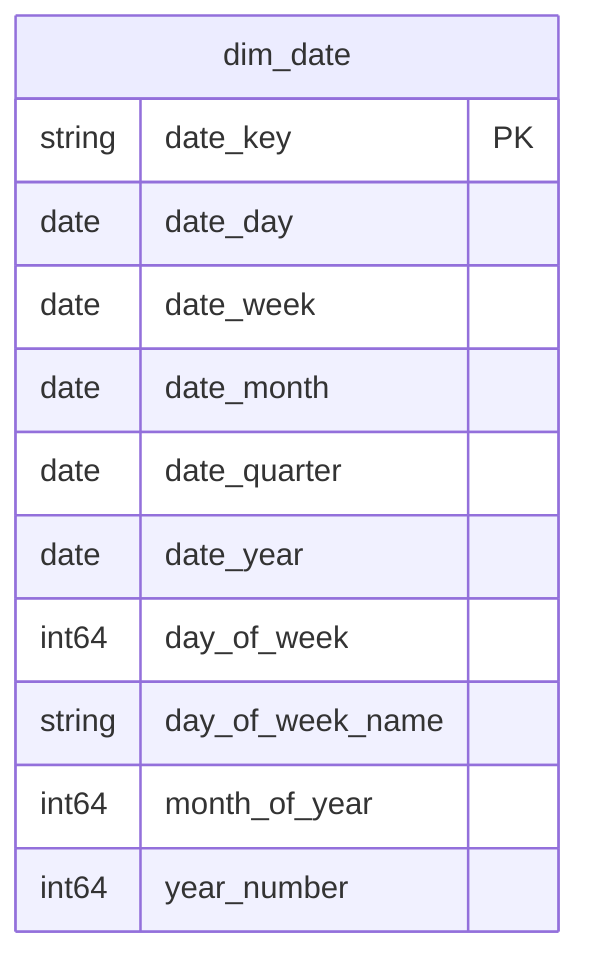

# Shared Kernel (Conformed Dimensions)

## Description
The Shared Kernel is the one bounded context every other context may depend on directly. It holds the conformed dimensions whose meaning is agreed across the bank, so that "the same day" means the same thing in Payments, in Lending and in Risk & Compliance. Nothing here belongs to a single context's aggregate, and nothing here may carry a context-specific attribute: the moment the calendar needs a `settlement_cycle_day` that only Payments understands, that attribute belongs in Payments, not in the kernel.

## Proposed Star Schema

### Fact Table(s)

The Shared Kernel proposes no fact tables. A fact records a business event, and a business event belongs to the context that owns it.

### Dimension Tables

1. **`dim_date`**
   The conformed calendar dimension. THE date dimension for every context in this model.
   - **Grain**: One row per calendar date.
   - **Columns**: `date_key`, `date_day`, `date_week`, `date_month`, `date_quarter`, `date_year`, `day_of_week`, `day_of_week_name`, `month_of_year`, `year_number`

## Star Schema Diagram

## Lineage

| Proposed Table | Source Model(s) |
| :--- | :--- |
| `dim_date` | `core_banking.stg_date_dimension` |

The table list and lineage above are generated from the per-table documents in this directory. If they disagree with a child document, the child is authoritative.
