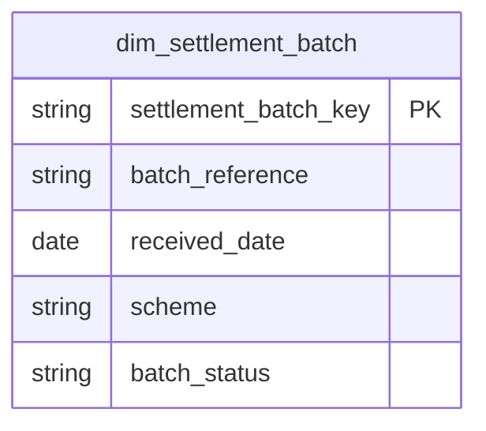

# Treasury

## Description
Treasury owns settlement: the batches the schemes pay in, the reconciliation of those batches against what Payments authorised, and the bank's own funding position behind them. It is on the context map because Payments already depends on it — `fact_payment_transactions` carries a `settlement_batch_key` — but no table in this context has been documented yet.

It is listed here rather than left out so that the dependency is visible. A context that other contexts already reference is a real part of the model whether or not anybody has written it down, and an index with nothing behind it says that more honestly than silence does.

## Proposed Star Schema

### Fact Table(s)

None documented yet. `fact_settlement_batches`, one row per batch received from a scheme, is the expected first table.

### Dimension Tables

None documented yet. `dim_settlement_batch` is already referenced by Payments and does not exist.

## Star Schema Diagram

## Lineage

| Proposed Table | Source Model(s) |
| :--- | :--- |

Nothing to report until this context has documents.
