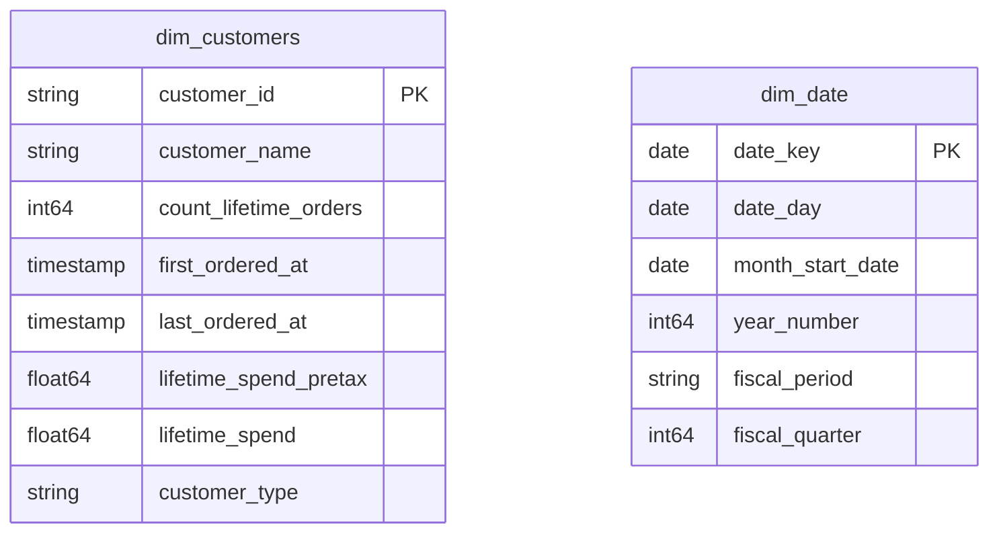

# Customer Identity

## Description
The Customer Identity context owns who a customer is and what their history adds up to. Its aggregate root is Customer, and the invariant it protects is that one person is one `customer_id` no matter which store they walked into. Lifetime totals live here rather than in Ordering because they are statements about a customer, not about an order — Ordering publishes the order events, and this context folds them into a customer's history.

## Proposed Star Schema

### Fact Table(s)

The Customer Identity context proposes no fact tables of its own yet. Customer lifecycle events (registration, first order, lapse) are candidates, but they are currently derived attributes on `dim_customers` rather than modelled events.

### Dimension Tables

1. **`dim_customers`**
   The Customer aggregate root, with lifetime totals folded in.
   - **Grain**: One row per customer.
   - **Columns**: `customer_id`, `customer_name`, `count_lifetime_orders`, `first_ordered_at`, `last_ordered_at`, `lifetime_spend_pretax`, `lifetime_spend`, `customer_type`

2. **`dim_date`**
   A local calendar copy predating the Shared Kernel. Scheduled for retirement.
   - **Grain**: One row per calendar date.
   - **Columns**: `date_key`, `date_day`, `month_start_date`, `year_number`, `fiscal_period`, `fiscal_quarter`

## Star Schema Diagram

## Lineage

| Proposed Table | Source Model(s) |
| :--- | :--- |
| `dim_customers` | `jaffle_shop.stg_customers`, `jaffle_shop.stg_orders` |
| `dim_date` | `jaffle_shop.metricflow_time_spine` |

The table list and lineage above are generated from the per-table documents in this directory. If they disagree with a child document, the child is authoritative.
