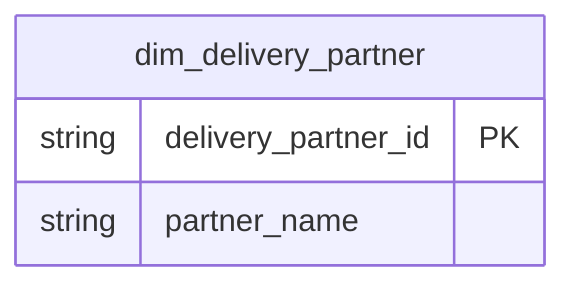

# Delivery Logistics

## Description
The Delivery Logistics context is on the context map but has no tables yet. It will own the delivery partner, the courier assignment and the delivery event, and `fact_orders.delivery_partner_id` is the anti-corruption seam where Ordering will read it. Until this context ships a `dim_delivery_partner` document, that reference resolves to nothing, which is the point of leaving this index here: an unmodelled context is a visible gap rather than a silent one.

## Proposed Star Schema

### Fact Table(s)

1. **`fact_delivery`** (not yet documented)
   One row per delivery attempt.

### Dimension Tables

1. **`dim_delivery_partner`** (not yet documented)
   The Delivery Partner aggregate root, referenced by `fact_orders` already.

## Star Schema Diagram

## Lineage

No lineage yet. The upstream models for this context do not exist in the dbt project.
