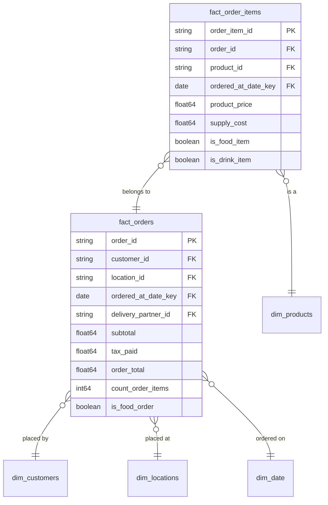

# Ordering

## Description
The Ordering context owns the transaction: what was ordered, from which store, by whom, and what it came to. Its aggregate root is Order, and `fact_order_items` is the line-item entity inside that aggregate rather than a fact in its own right — nothing outside this context should reach an order item except through its order. Every other dimension this context reads is borrowed across a boundary: Customer from Customer Identity, Location from Store Operations, Product from Product Catalog, and the calendar from the Shared Kernel.

## Proposed Star Schema

### Fact Table(s)

1. **`fact_orders`**
   The Order aggregate root. One row per order placed.
   - **Grain**: One row per order.
   - **Columns**: `order_id`, `customer_id`, `location_id`, `ordered_at_date_key`, `delivery_partner_id`, `subtotal`, `tax_paid`, `order_total`, `order_cost`, `count_food_items`, `count_drink_items`, `count_order_items`, `is_food_order`, `is_drink_order`, `customer_order_number`

2. **`fact_order_items`**
   The line items of an order, inside the Order aggregate.
   - **Grain**: One row per product on an order.
   - **Columns**: `order_item_id`, `order_id`, `product_id`, `ordered_at_date_key`, `product_price`, `supply_cost`, `is_food_item`, `is_drink_item`

### Dimension Tables

The Ordering context documents no dimensions of its own. Every dimension it reads is owned by another bounded context and borrowed through the context map.

## Star Schema Diagram

## Lineage

| Proposed Table | Source Model(s) |
| :--- | :--- |
| `fact_orders` | `jaffle_shop.stg_orders`, `jaffle_shop.stg_order_items` |
| `fact_order_items` | `jaffle_shop.stg_order_items`, `jaffle_shop.stg_products`, `jaffle_shop.stg_supplies` |

The table list and lineage above are generated from the per-table documents in this directory. If they disagree with a child document, the child is authoritative.
