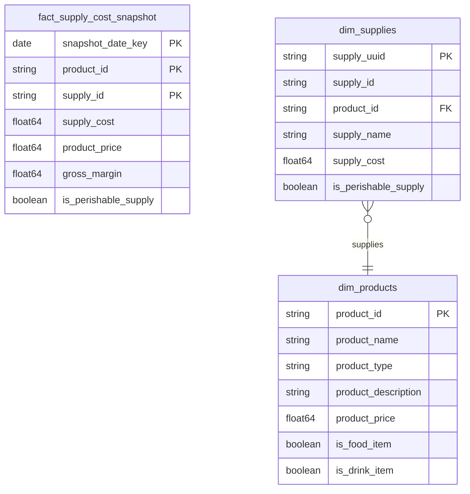

# Product Catalog

## Description
The Product Catalog context owns what the shop sells and what it costs to make. Its aggregate root is Product; a supply is a component of a product and has no meaning outside one. Prices here are the current catalog price, which is deliberately not the same thing as the price on a historical order — Ordering captures that at the point of sale, and the difference between the two is a boundary, not a bug.

## Proposed Star Schema

### Fact Table(s)

1. **`fact_supply_cost_snapshot`**
   Daily snapshot of what each product costs to supply, and the margin at the current catalog price.
   - **Grain**: One row per product per supply per day.
   - **Columns**: `snapshot_date_key`, `product_id`, `supply_id`, `supply_cost`, `product_price`, `gross_margin`, `is_perishable_supply`

### Dimension Tables

1. **`dim_products`**
   The Product aggregate root.
   - **Grain**: One row per product in the catalog.
   - **Columns**: `product_id`, `product_name`, `product_type`, `product_description`, `product_price`, `is_food_item`, `is_drink_item`

2. **`dim_supplies`**
   The components of a product, inside the Product aggregate.
   - **Grain**: One row per supply per product.
   - **Columns**: `supply_uuid`, `supply_id`, `product_id`, `supply_name`, `supply_cost`, `is_perishable_supply`

## Star Schema Diagram

## Lineage

| Proposed Table | Source Model(s) |
| :--- | :--- |
| `fact_supply_cost_snapshot` | `jaffle_shop.stg_supplies`, `jaffle_shop.stg_products` |
| `dim_products` | `jaffle_shop.stg_products` |
| `dim_supplies` | `jaffle_shop.stg_supplies` |

The table list and lineage above are generated from the per-table documents in this directory. If they disagree with a child document, the child is authoritative.
