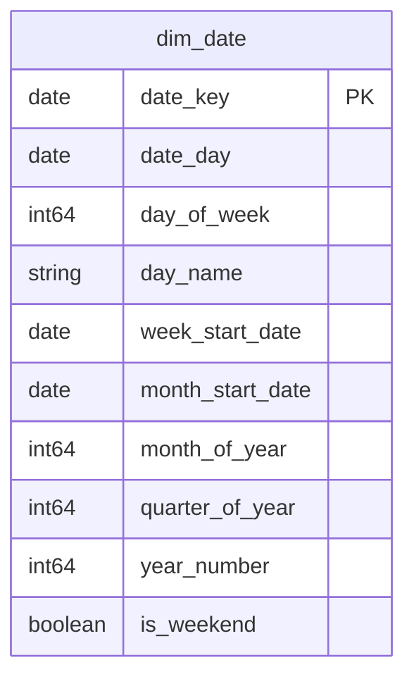

# Shared Kernel (Conformed Dimensions)

## Description
The Shared Kernel is the one bounded context every other context is allowed to depend on directly. It holds the conformed dimensions whose ubiquitous language is agreed model-wide, so that "the same day" means the same thing in Ordering, in Store Operations and in Customer Identity. Nothing here belongs to a single context's aggregate. Anything in the kernel that starts to acquire context-specific meaning is a signal that it should leave the kernel and be mapped across a context boundary instead.

## Proposed Star Schema

### Fact Table(s)

The Shared Kernel proposes no fact tables. A fact records a domain event, and a domain event belongs to the context that owns it.

### Dimension Tables

1. **`dim_date`**
   The conformed calendar dimension. THE date dimension for every context in this model.
   - **Grain**: One row per calendar date.
   - **Columns**: `date_key`, `date_day`, `day_of_week`, `day_name`, `week_start_date`, `month_start_date`, `month_of_year`, `quarter_of_year`, `year_number`, `is_weekend`

## Star Schema Diagram

## Lineage

| Proposed Table | Source Model(s) |
| :--- | :--- |
| `dim_date` | `jaffle_shop.metricflow_time_spine` |

The table list and lineage above are generated from the per-table documents in this directory. If they disagree with a child document, the child is authoritative.
