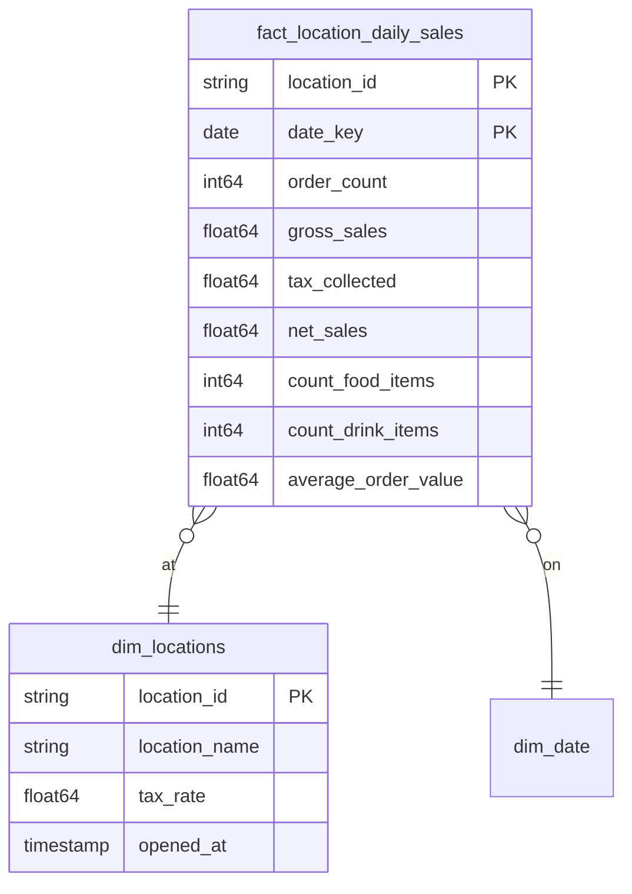

# Store Operations

## Description
The Store Operations context owns the shops themselves and how each one performs day to day. Its aggregate root is Location, and the tax rate lives here because it is a property of where an order was taken, not of the order. Ordering borrows `dim_locations` to attribute an order to a store; the daily rollup in this context is the reverse view, aggregating those same orders per store per day.

## Proposed Star Schema

### Fact Table(s)

1. **`fact_location_daily_sales`**
   Daily performance per store.
   - **Grain**: One row per store per day.
   - **Columns**: `location_id`, `date_key`, `order_count`, `gross_sales`, `tax_collected`, `net_sales`, `count_food_items`, `count_drink_items`, `average_order_value`

### Dimension Tables

1. **`dim_locations`**
   The Location aggregate root.
   - **Grain**: One row per store.
   - **Columns**: `location_id`, `location_name`, `tax_rate`, `opened_at`

## Star Schema Diagram

## Lineage

| Proposed Table | Source Model(s) |
| :--- | :--- |
| `fact_location_daily_sales` | `jaffle_shop.stg_orders`, `jaffle_shop.stg_locations` |
| `dim_locations` | `jaffle_shop.stg_locations` |

The table list and lineage above are generated from the per-table documents in this directory. If they disagree with a child document, the child is authoritative.
