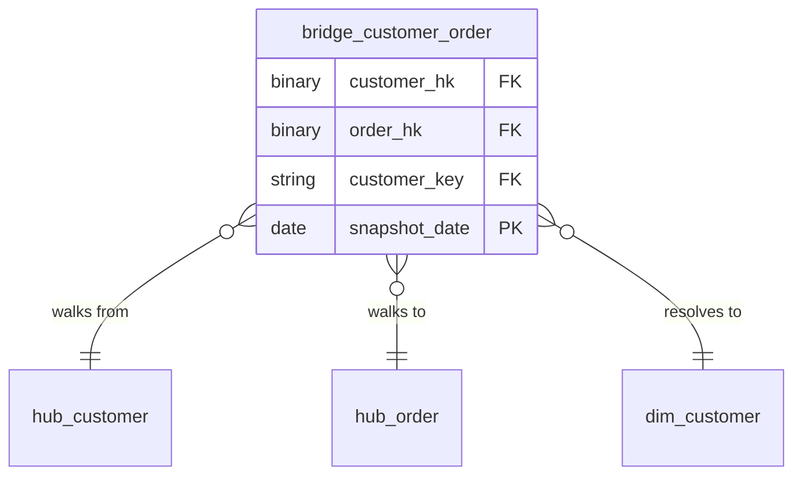

# Business Vault

## Description
One table, and the only one in the set that touches both layers at once. The bridge exists because the question "which orders belong to this customer" is asked constantly and answering it from the raw vault means walking a link every time. It is rebuilt from scratch on every run and nothing depends on it, which is what makes it safe for it to reach across a boundary the other contexts respect.

## Proposed Business Vault

### Bridge Tables

1. **`bridge_customer_order`**
   A precomputed walk of the order-to-customer link, carrying the presentation layer's surrogate key alongside the vault's hash keys.
   - **Grain**: One row per customer-and-order pair, per snapshot date.
   - **Columns**: `customer_hk`, `order_hk`, `customer_key`, `snapshot_date`, `load_date`

## Data Model Diagram

## Lineage

| Proposed Table | Source Model(s) |
| :--- | :--- |
| `bridge_customer_order` | `northwind.lnk_order_customer` |

The table list and lineage above are generated from the per-table documents in
this directory. If they disagree with a child document, the child is authoritative.
