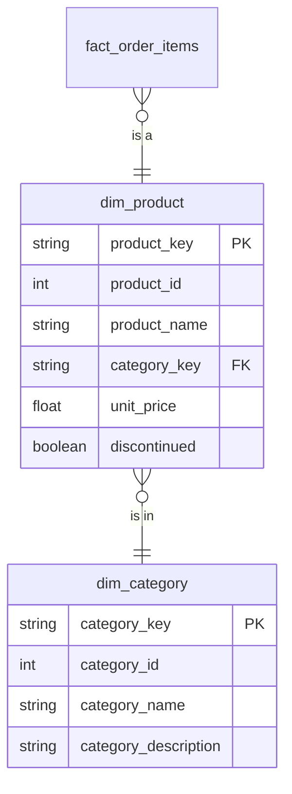

# Presentation — Catalog

## Description
The product side of the star, and the one place it snowflakes. Category is not folded into the product dimension: Northwind's categories carry a long description that would be repeated on every product row, and the reporting tool browses categories on their own. That makes `dim_category` an outrigger — a dimension hanging off a dimension — which is exactly the shape a snowflake schema is named for. This context also took a stale copy of the calendar, which it should not have.

## Proposed Star Schema

### Dimension Tables

1. **`dim_product`**
   One row per product, joined out to its category.
   - **Grain**: One row per product.
   - **Columns**: `product_key`, `product_id`, `product_name`, `category_key`, `supplier_name`, `unit_price`, `units_in_stock`, `discontinued`

2. **`dim_category`**
   The category outrigger, hanging off `dim_product`.
   - **Grain**: One row per product category.
   - **Columns**: `category_key`, `category_id`, `category_name`, `category_description`

3. **`dim_date`**
   A stale local copy of the kernel's calendar. Deprecated.
   - **Grain**: One row per calendar day, as this context sees it.
   - **Columns**: `date_key`, `full_date`, `calendar_year`, `calendar_month`, `fiscal_period`

## Snowflake Schema Diagram

## Lineage

| Proposed Table | Source Model(s) |
| :--- | :--- |
| `dim_product` | `northwind.stg_products`, `northwind.stg_suppliers` |
| `dim_category` | `northwind.stg_categories` |
| `dim_date` | `northwind.dim_date_generated` |

The table list and lineage above are generated from the per-table documents in
this directory. If they disagree with a child document, the child is authoritative.
