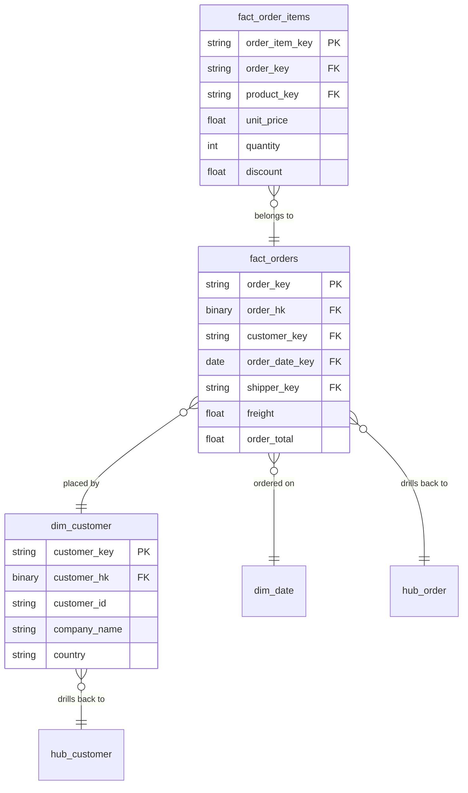

# Presentation — Sales

## Description
The star a reporting tool actually points at. Every table here is built from the raw vault rather than from the source, which is what the column-level lineage records: `dim_customer` is a flattening of the customer satellite, and `fact_orders` is the link and the order satellite joined together and given a grain. The facts keep the vault's hash keys alongside their own surrogate keys so that a number on a dashboard can be traced back to the row that produced it.

## Proposed Star Schema

### Fact Table(s)

1. **`fact_orders`**
   One row per order, with freight and the order total rolled up.
   - **Grain**: One row per order.
   - **Columns**: `order_key`, `order_hk`, `customer_key`, `order_date_key`, `shipper_key`, `freight`, `order_total`, `line_count`, `days_to_ship`

2. **`fact_order_items`**
   The line items of an order.
   - **Grain**: One row per product on an order.
   - **Columns**: `order_item_key`, `order_key`, `product_key`, `order_date_key`, `unit_price`, `quantity`, `discount`, `extended_price`

### Dimension Tables

1. **`dim_customer`**
   The current view of a customer, flattened from the satellite.
   - **Grain**: One row per customer.
   - **Columns**: `customer_key`, `customer_hk`, `customer_id`, `company_name`, `contact_name`, `city`, `country`

## Star Schema Diagram

## Lineage

| Proposed Table | Source Model(s) |
| :--- | :--- |
| `fact_orders` | `northwind.lnk_order_customer`, `northwind.sat_order_details` |
| `fact_order_items` | `northwind.stg_order_details` |
| `dim_customer` | `northwind.sat_customer_details` |

The table list and lineage above are generated from the per-table documents in
this directory. If they disagree with a child document, the child is authoritative.
