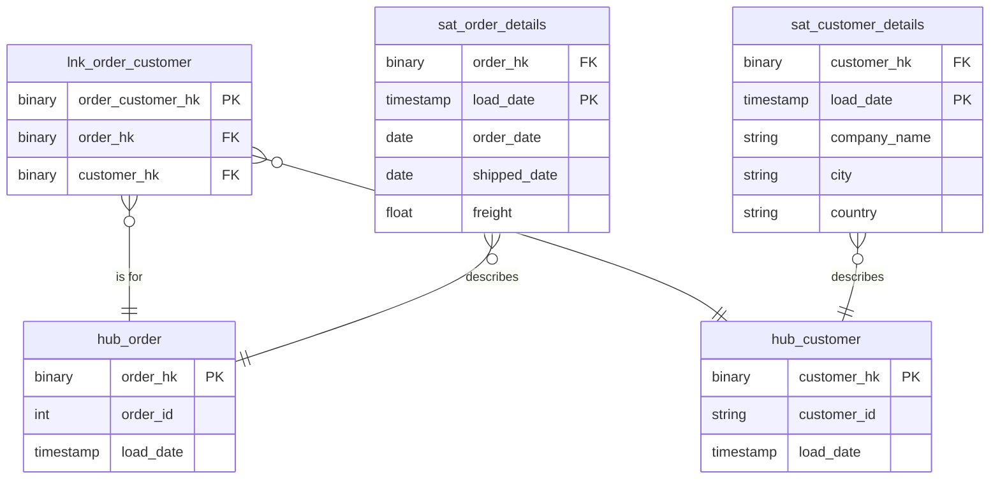

# Raw Vault

## Description
The layer that records what arrived. Hubs hold the Northwind business keys, the link holds the order-to-customer relationship as loaded, and the satellites hold everything descriptive with a full history. Nothing here is reshaped for a query: reshaping is the presentation layer's job, and keeping the two apart is the reason a hybrid warehouse is built this way at all.

## Proposed Raw Vault

### Hubs

1. **`hub_customer`**
   Northwind's `CustomerID`, hashed.
   - **Grain**: One row per customer business key.
   - **Columns**: `customer_hk`, `customer_id`, `load_date`, `record_source`

2. **`hub_order`**
   Northwind's `OrderID`, hashed.
   - **Grain**: One row per order business key.
   - **Columns**: `order_hk`, `order_id`, `load_date`, `record_source`

### Links

1. **`lnk_order_customer`**
   Which customer placed which order, as loaded.
   - **Grain**: One row per unique order-and-customer pair.
   - **Columns**: `order_customer_hk`, `order_hk`, `customer_hk`, `load_date`, `record_source`

### Satellites

1. **`sat_customer_details`**
   Everything Northwind records about a customer, over time.
   - **Grain**: One row per customer per load date.
   - **Columns**: `customer_hk`, `load_date`, `effective_from`, `hashdiff`, `company_name`, `contact_name`, `contact_title`, `city`, `country`, `phone`, `record_source`

2. **`sat_order_details`**
   The order's own attributes, over time.
   - **Grain**: One row per order per load date.
   - **Columns**: `order_hk`, `load_date`, `effective_from`, `hashdiff`, `order_date`, `required_date`, `shipped_date`, `freight`, `ship_city`, `ship_country`, `record_source`

## Data Model Diagram

## Lineage

| Proposed Table | Source Model(s) |
| :--- | :--- |
| `hub_customer` | `northwind.stg_customers` |
| `hub_order` | `northwind.stg_orders` |
| `lnk_order_customer` | `northwind.stg_orders` |
| `sat_customer_details` | `northwind.stg_customers` |
| `sat_order_details` | `northwind.stg_orders` |

The table list and lineage above are generated from the per-table documents in
this directory. If they disagree with a child document, the child is authoritative.
