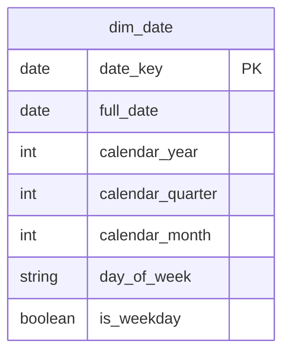

# Shared Kernel

## Description
The calendar, and nothing else. Both layers of this warehouse read it: the presentation star joins to it the way any star joins to a date dimension, and the raw vault's satellites carry load dates that are compared against it. It is the only table in the set that belongs to neither layer.

## Proposed Schema

### Dimension Tables

1. **`dim_date`**
   The conformed calendar. The authority for `date_key`.
   - **Grain**: One row per calendar day.
   - **Columns**: `date_key`, `full_date`, `calendar_year`, `calendar_quarter`, `calendar_month`, `day_of_week`, `is_weekday`

## Data Model Diagram

## Lineage

| Proposed Table | Source Model(s) |
| :--- | :--- |
| `dim_date` | `northwind.dim_date_generated` |

The table list and lineage above are generated from the per-table documents in
this directory. If they disagree with a child document, the child is authoritative.
