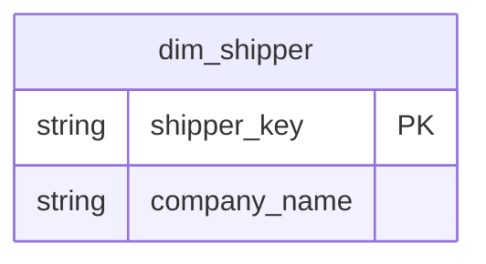

# Shipping

## Description
Northwind's `Shippers` table, and the freight analysis that would sit on top of it. On the context map because `fact_orders` already carries a `shipper_key`, but nothing here has been modelled: the shipper feed is three rows that have not changed since 1996, and nobody has decided whether that deserves a dimension or a lookup.

## Proposed Star Schema

### Dimension Tables

Nothing yet. `dim_shipper` is the first table this context will need, and `fact_orders` already references it.

## Star Schema Diagram

