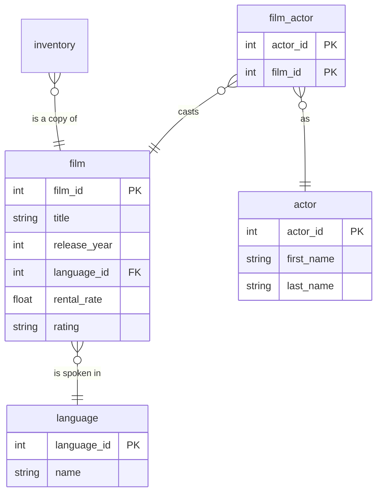

# Catalog

## Description
The film catalogue, and the two junction tables that make it a proper relational schema rather than a spreadsheet. A film has many actors and an actor is in many films, so neither can hold a foreign key to the other: `film_actor` exists solely to carry that pair. It has no attributes of its own beyond the timestamp, which is the mark of a pure associative entity.

`language` is a lookup rather than an entity: six rows, a name, and nothing that would ever be true of a language independently of a film referring to it.

## Proposed Schema

### Entities

1. **`film`**
   The catalogue. 1,000 rows.
   - **Grain**: One row per film.
   - **Columns**: `film_id`, `title`, `description`, `release_year`, `language_id`, `rental_duration`, `rental_rate`, `length`, `replacement_cost`, `rating`, `last_update`

2. **`actor`**
   200 actors.
   - **Grain**: One row per actor.
   - **Columns**: `actor_id`, `first_name`, `last_name`, `last_update`

### Associative Tables

1. **`film_actor`**
   The many-to-many between films and actors. 5,462 rows, no attributes.
   - **Grain**: One row per film-and-actor pair.
   - **Columns**: `actor_id`, `film_id`, `last_update`

2. **`film_category`**
   The many-to-many between films and categories. Written before the category table was documented.
   - **Grain**: One row per film-and-category pair.
   - **Columns**: `film_id`, `category_id`, `last_update`

### Lookup Tables

1. **`language`**
   Six languages. A lookup, not an entity.
   - **Grain**: One row per language.
   - **Columns**: `language_id`, `name`, `last_update`

## Entity Relationship Diagram

## Lineage

| Proposed Table | Source Model(s) |
| :--- | :--- |
| `film` | `sakila.raw_film` |
| `actor` | `sakila.raw_actor` |
| `film_actor` | `sakila.raw_film_actor` |
| `film_category` | `sakila.raw_film_category` |
| `language` | `sakila.raw_language` |

The table list and lineage above are generated from the per-table documents in
this directory. If they disagree with a child document, the child is authoritative.
