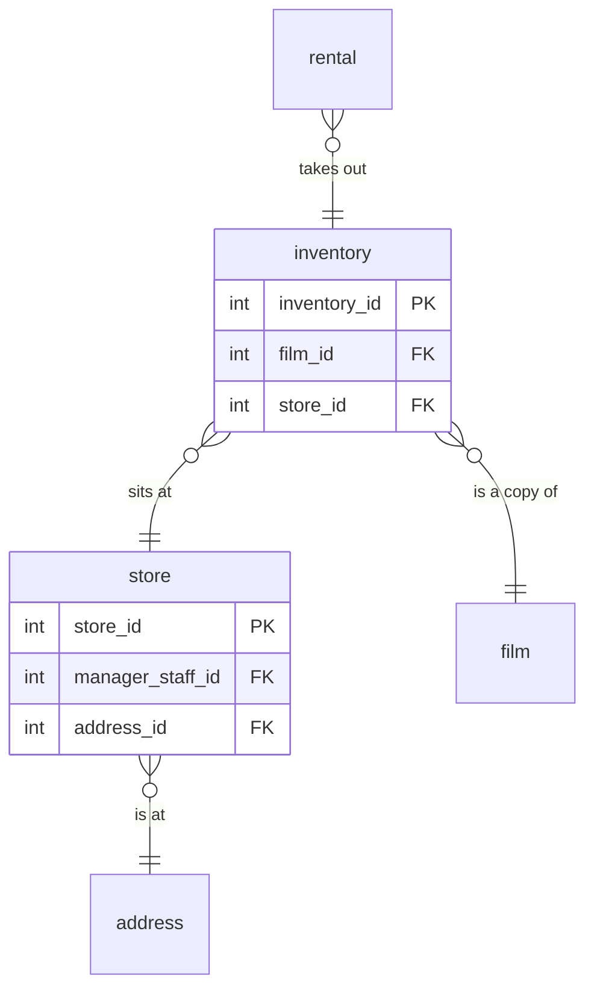

# Inventory

## Description
Physical copies, and the two stores that hold them. `inventory` is the entity that turns a film into something rentable: one row per disc on a shelf, so a film with four copies at one store has four rows. Nothing about the film is repeated here, only its key.

## Proposed Schema

### Entities

1. **`inventory`**
   4,581 physical copies.
   - **Grain**: One row per physical copy of a film at a store.
   - **Columns**: `inventory_id`, `film_id`, `store_id`, `last_update`

2. **`store`**
   Two stores.
   - **Grain**: One row per store.
   - **Columns**: `store_id`, `manager_staff_id`, `address_id`, `last_update`

## Entity Relationship Diagram

## Lineage

| Proposed Table | Source Model(s) |
| :--- | :--- |
| `inventory` | `sakila.raw_inventory` |
| `store` | `sakila.raw_store` |

The table list and lineage above are generated from the per-table documents in
this directory. If they disagree with a child document, the child is authoritative.
