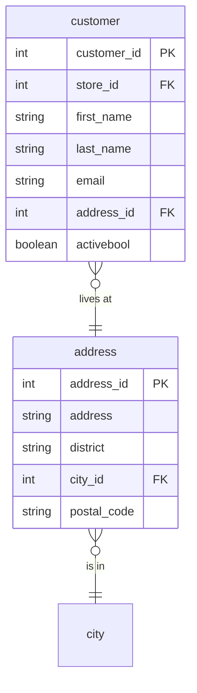

# Party

## Description
Customers and where they live. `address` is an entity of its own rather than columns on the customer, because a store has an address too and a staff member will as well -- the moment three things need an address, an address becomes a table.

This context also took a copy of the country table, which it should not have.

## Proposed Schema

### Entities

1. **`customer`**
   599 customers.
   - **Grain**: One row per customer.
   - **Columns**: `customer_id`, `store_id`, `first_name`, `last_name`, `email`, `address_id`, `activebool`, `create_date`, `last_update`

2. **`address`**
   603 addresses, shared by customers and stores.
   - **Grain**: One row per address.
   - **Columns**: `address_id`, `address`, `address2`, `district`, `city_id`, `postal_code`, `phone`, `last_update`

### Reference Tables

1. **`country`**
   A stale local copy of the kernel's country table. Deprecated.
   - **Grain**: One row per country, as this context sees it.
   - **Columns**: `country_id`, `country`, `iso_code`

## Entity Relationship Diagram

## Lineage

| Proposed Table | Source Model(s) |
| :--- | :--- |
| `customer` | `sakila.raw_customer` |
| `address` | `sakila.raw_address` |
| `country` | `sakila.raw_country` |

The table list and lineage above are generated from the per-table documents in
this directory. If they disagree with a child document, the child is authoritative.
