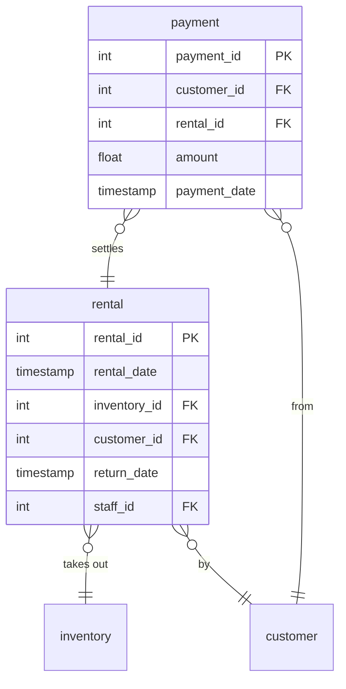

# Rental

## Description
The two transactional tables. A rental is a copy leaving a shelf; a payment is money arriving. They are separate because they are not one-to-one -- a rental can be paid for late, in parts, or not at all -- and collapsing them would have meant a nullable amount on every rental row and no way to record two payments against one.

## Proposed Schema

### Entities

1. **`rental`**
   16,044 rentals.
   - **Grain**: One row per rental of one copy.
   - **Columns**: `rental_id`, `rental_date`, `inventory_id`, `customer_id`, `return_date`, `staff_id`, `last_update`

2. **`payment`**
   14,596 payments.
   - **Grain**: One row per payment.
   - **Columns**: `payment_id`, `customer_id`, `staff_id`, `rental_id`, `amount`, `payment_date`

## Entity Relationship Diagram

## Lineage

| Proposed Table | Source Model(s) |
| :--- | :--- |
| `rental` | `sakila.raw_rental` |
| `payment` | `sakila.raw_payment` |

The table list and lineage above are generated from the per-table documents in
this directory. If they disagree with a child document, the child is authoritative.
