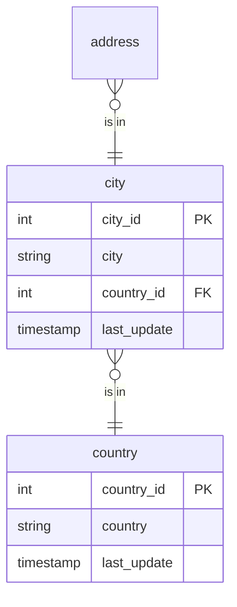

# Shared Kernel

## Description
Geography, normalised the way an operational schema normalises it: an address points at a city, a city points at a country, and neither the address nor the customer carries a country name anywhere. This is third normal form doing what it was designed for -- one fact in one place -- and it is why renaming a country here is a single-row update rather than a migration.

Both tables are read by Party and by Inventory. Neither belongs to either.

## Proposed Schema

### Reference Tables

1. **`country`**
   The conformed country table. 109 rows.
   - **Grain**: One row per country.
   - **Columns**: `country_id`, `country`, `last_update`

2. **`city`**
   600 cities, each pointing at a country.
   - **Grain**: One row per city.
   - **Columns**: `city_id`, `city`, `country_id`, `last_update`

## Entity Relationship Diagram

## Lineage

| Proposed Table | Source Model(s) |
| :--- | :--- |
| `country` | `sakila.raw_country` |
| `city` | `sakila.raw_city` |

The table list and lineage above are generated from the per-table documents in
this directory. If they disagree with a child document, the child is authoritative.
