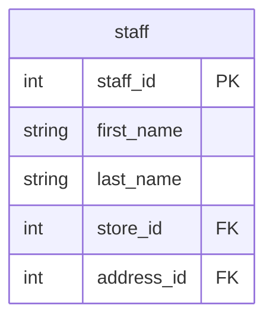

# Staffing

## Description
Staff, and the store-manager relationship. On the context map because `rental`, `payment` and `store` all already carry a `staff_id` or a `manager_staff_id`, but nothing here has been modelled: the staff table carries a password hash and a photo, and deciding what an analytics replica of it should contain is a conversation nobody has had yet.

## Proposed Schema

### Entities

Nothing yet. `staff` is the first table this context will need, and three tables already reference it.

## Entity Relationship Diagram

