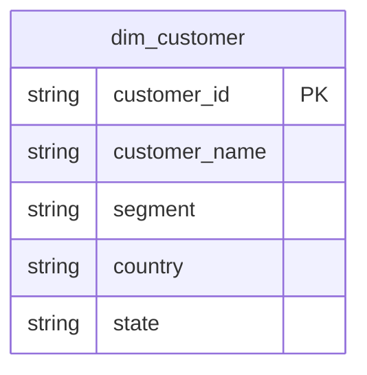

# 顧客 [EN] Customer

## Description
顧客コンテキストは購入者と、その所在地・セグメントを所有します。 [EN] The Customer context owns the buyer, where they are, and which segment they belong to.

## Proposed Star Schema

### Dimension Tables

1. **`dim_customer`**
   購入者。 [EN] The buyer.
   - **Grain**: 顧客ごとに 1 行。 [EN] One row per customer.
   - **Columns**: `customer_id`, `customer_name`, `segment`, `country`, `city`, `state`

## Star Schema Diagram

## Lineage

| Proposed Table | Source Model(s) |
| :--- | :--- |
| `dim_customer` | `superstore.stg_customers` |

この一覧と系譜は本ディレクトリの各テーブル文書から生成されています。 [EN] The table list and lineage above are generated from the per-table documents in this directory.
