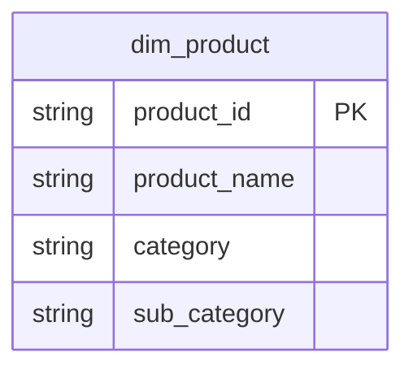

# 商品 [EN] Product

## Description
商品コンテキストは販売対象の商品分類を所有します。カテゴリとサブカテゴリは商品行に平坦化しており、それ自体を独立したテーブルにはしていません。 [EN] The Product context owns what is for sale and how it is classified. Category and sub-category are flattened onto the product row rather than kept as tables of their own.

## Proposed Star Schema

### Dimension Tables

1. **`dim_product`**
   販売商品。 [EN] The product sold.
   - **Grain**: 商品ごとに 1 行。 [EN] One row per product.
   - **Columns**: `product_id`, `product_name`, `category`, `sub_category`

## Star Schema Diagram

## Lineage

| Proposed Table | Source Model(s) |
| :--- | :--- |
| `dim_product` | `superstore.stg_products` |

この一覧と系譜は本ディレクトリの各テーブル文書から生成されています。 [EN] The table list and lineage above are generated from the per-table documents in this directory.
