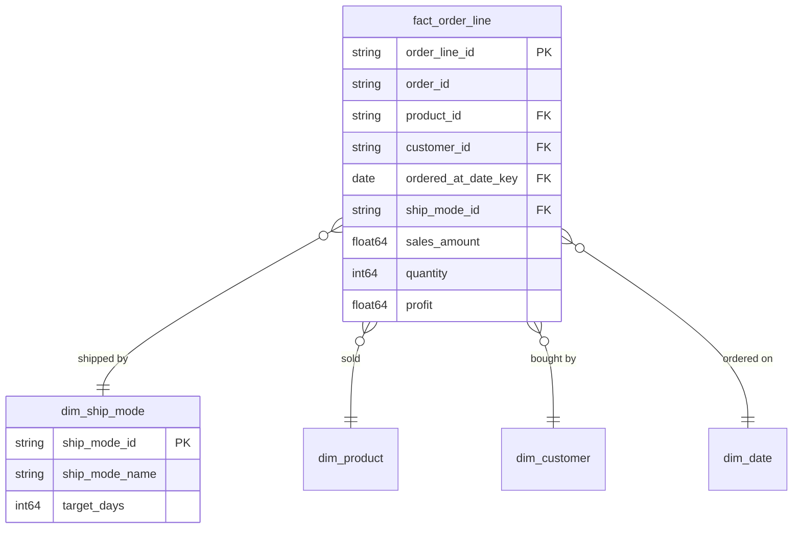

# 販売 [EN] Sales

## Description
販売コンテキストは取引を所有します。何が、いつ、どの配送方法で売れたかです。読み取るディメンションのうち、配送方法だけが自身の所有であり、商品・顧客・暦はいずれも境界の外から借りています。 [EN] The Sales context owns the transaction: what sold, when, and how it shipped. Of the dimensions it reads, only the shipping method is its own; product, customer and the calendar are all borrowed from beyond the boundary.

## Proposed Star Schema

### Fact Table(s)

1. **`fact_order_line`**
   注文明細ごとに 1 行。 [EN] One row per order line.
   - **Grain**: 注文 1 件の中の商品 1 点ごとに 1 行。 [EN] One row per product on an order.
   - **Columns**: `order_line_id`, `order_id`, `product_id`, `customer_id`, `ordered_at_date_key`, `ship_mode_id`, `region_id`, `sales_amount`, `quantity`, `discount`, `profit`

### Dimension Tables

1. **`dim_ship_mode`**
   配送方法。 [EN] The shipping method.
   - **Grain**: 配送方法ごとに 1 行。 [EN] One row per shipping method.
   - **Columns**: `ship_mode_id`, `ship_mode_name`, `target_days`

## Star Schema Diagram

## Lineage

| Proposed Table | Source Model(s) |
| :--- | :--- |
| `fact_order_line` | `superstore.stg_orders` |
| `dim_ship_mode` | `superstore.stg_ship_modes` |

この一覧と系譜は本ディレクトリの各テーブル文書から生成されています。子文書と食い違う場合は、子文書が正です。 [EN] The table list and lineage above are generated from the per-table documents in this directory. If they disagree with a child document, the child is authoritative.
