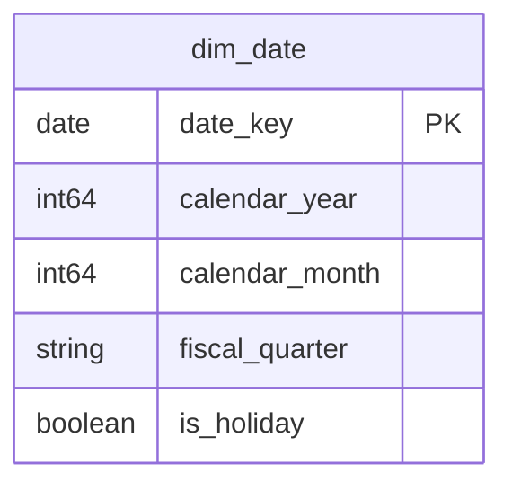

# 共有カーネル [EN] Shared Kernel

## Description
共有カーネルは、どのコンテキストも参照するが、どのコンテキストも所有すべきでないものを所有します。ここでは暦です。 [EN] The Shared Kernel owns what every context reads and none of them should own. Here, that is the calendar.

## Proposed Star Schema

### Dimension Tables

1. **`dim_date`**
   全コンテキストで統一された暦。 [EN] The calendar, conformed across every context.
   - **Grain**: 1 日ごとに 1 行。 [EN] One row per day.
   - **Columns**: `date_key`, `calendar_year`, `calendar_month`, `fiscal_quarter`, `is_holiday`

## Star Schema Diagram

## Lineage

| Proposed Table | Source Model(s) |
| :--- | :--- |
| `dim_date` | `superstore.stg_calendar` |

この一覧と系譜は本ディレクトリの各テーブル文書から生成されています。 [EN] The table list and lineage above are generated from the per-table documents in this directory.
