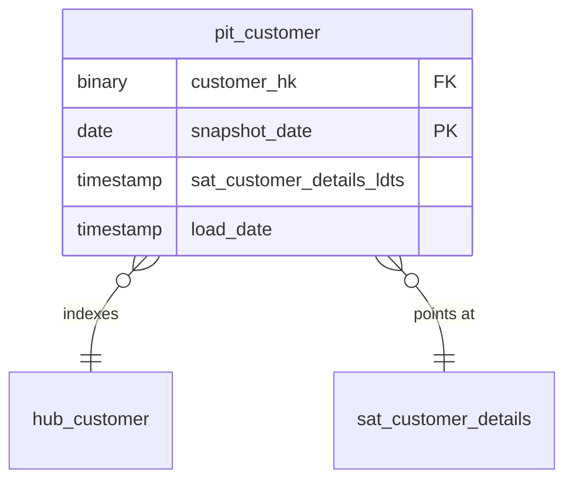

# Business Vault

## Description
The one context that is not raw. A point-in-time table is a query convenience, not a record of what arrived: it is rebuilt from the satellites it indexes and can be dropped and recreated without losing anything. It lives in its own context so that nothing in the raw vault ever depends on it.

## Proposed Business Vault

### Point-in-Time Tables

1. **`pit_customer`**
   One row per customer per snapshot date, carrying the load date of the customer satellite that was current on that date.
   - **Grain**: One row per customer per snapshot date.
   - **Columns**: `customer_hk`, `snapshot_date`, `sat_customer_details_ldts`, `load_date`

## Data Model Diagram

## Lineage

| Proposed Table | Source Model(s) |
| :--- | :--- |
| `pit_customer` | `tpch.v_stg_customer` |

The table list and lineage above are generated from the per-table documents in
this directory. If they disagree with a child document, the child is authoritative.
