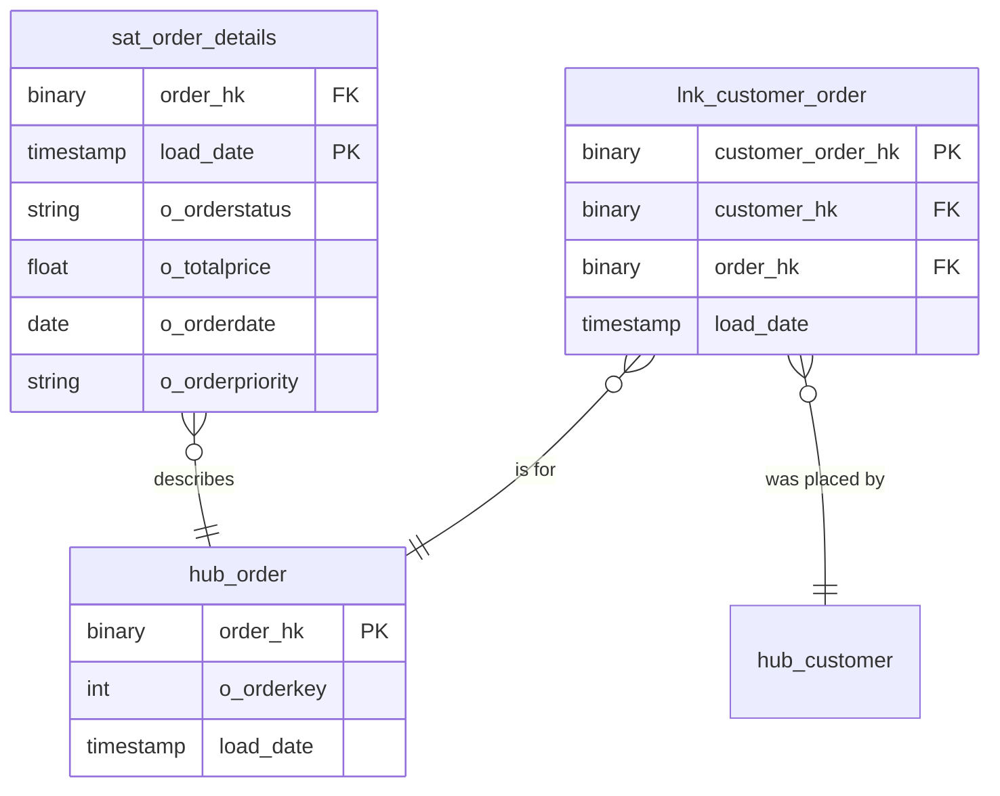

# Ordering

## Description
Ordering owns the order key and the relationship between a customer and an order. That link is the reason this context exists: in a raw vault the relationship is a table in its own right, loaded once and never updated, so that a customer moving between market segments cannot retroactively change who placed which order. Ordering owns no descriptive data about the customer — it borrows the hub from Party and stops there.

## Proposed Raw Vault

### Hubs

1. **`hub_order`**
   The order business key, `o_orderkey`, hashed.
   - **Grain**: One row per order business key.
   - **Columns**: `order_hk`, `o_orderkey`, `load_date`, `record_source`

### Links

1. **`lnk_customer_order`**
   The relationship between a customer and an order, as loaded.
   - **Grain**: One row per unique customer-and-order pair.
   - **Columns**: `customer_order_hk`, `customer_hk`, `order_hk`, `load_date`, `record_source`

### Satellites

1. **`sat_order_details`**
   The order's own attributes, tracked over time.
   - **Grain**: One row per order per load date.
   - **Columns**: `order_hk`, `load_date`, `effective_from`, `hashdiff`, `o_orderstatus`, `o_totalprice`, `o_orderdate`, `o_orderpriority`, `o_clerk`, `o_shippriority`, `o_comment`, `record_source`

## Data Model Diagram

## Lineage

| Proposed Table | Source Model(s) |
| :--- | :--- |
| `hub_order` | `tpch.v_stg_orders` |
| `lnk_customer_order` | `tpch.v_stg_orders` |
| `sat_order_details` | `tpch.v_stg_orders` |

The table list and lineage above are generated from the per-table documents in
this directory. If they disagree with a child document, the child is authoritative.
