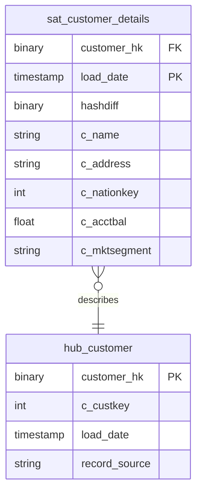

# Party

## Description
The Party context owns the customer business key and everything descriptive that hangs off it. It owns no links: a customer's relationship to an order belongs to Ordering, and a customer's relationship to a nation is carried as an attribute on the satellite rather than as a link, because TPC-H's customer nation is a slowly-changing attribute rather than a relationship the business reasons about independently.

## Proposed Raw Vault

### Hubs

1. **`hub_customer`**
   The customer business key, `c_custkey`, hashed.
   - **Grain**: One row per customer business key.
   - **Columns**: `customer_hk`, `c_custkey`, `load_date`, `record_source`

### Satellites

1. **`sat_customer_details`**
   Everything TPC-H records about a customer, tracked over time.
   - **Grain**: One row per customer per load date.
   - **Columns**: `customer_hk`, `load_date`, `effective_from`, `hashdiff`, `c_name`, `c_address`, `c_nationkey`, `c_phone`, `c_acctbal`, `c_mktsegment`, `c_comment`, `record_source`

## Data Model Diagram

## Lineage

| Proposed Table | Source Model(s) |
| :--- | :--- |
| `hub_customer` | `tpch.v_stg_customer` |
| `sat_customer_details` | `tpch.v_stg_customer` |

The table list and lineage above are generated from the per-table documents in
this directory. If they disagree with a child document, the child is authoritative.
