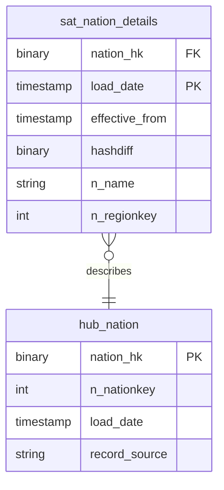

# Shared Kernel

## Description
Geography is the one part of this vault every other subject area is allowed to depend on directly. Nation is loaded once, from the reference feed, and every context that needs a country reads this hub rather than taking a copy — that being the whole point of a shared kernel. Region is deliberately not modelled: TPC-H's five regions never change, and a hub for a table that never changes buys nothing.

## Proposed Raw Vault

### Hubs

1. **`hub_nation`**
   The conformed nation hub. The authority for `n_nationkey`.
   - **Grain**: One row per nation business key.
   - **Columns**: `nation_hk`, `n_nationkey`, `load_date`, `record_source`

### Satellites

1. **`sat_nation_details`**
   Descriptive context for a nation, tracked over time.
   - **Grain**: One row per nation per load date.
   - **Columns**: `nation_hk`, `load_date`, `effective_from`, `hashdiff`, `n_name`, `n_regionkey`, `n_comment`, `record_source`

### Links

The Shared Kernel declares no links. A link between two hubs belongs to the context that cares about the relationship, not to the context that owns the keys.

## Data Model Diagram

## Lineage

| Proposed Table | Source Model(s) |
| :--- | :--- |
| `hub_nation` | `tpch.v_stg_nation` |
| `sat_nation_details` | `tpch.v_stg_nation` |

The table list and lineage above are generated from the per-table documents in
this directory. If they disagree with a child document, the child is authoritative.
