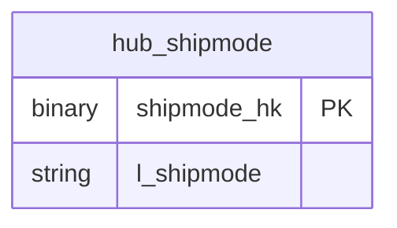

# Shipping

## Description
The ship mode and line-item context. It is on the context map because `lnk_customer_order` already carries a reference to its hub, but nothing here has been modelled yet: TPC-H's `lineitem` is the largest table in the schema and loading it into a vault is its own piece of work.

## Proposed Raw Vault

### Hubs

Nothing yet. `hub_shipmode` is the first table this context will need, and `lnk_customer_order` already references it.

## Data Model Diagram

