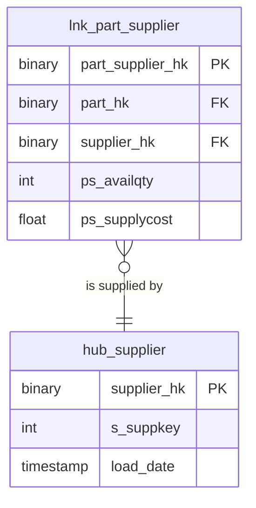

# Supply

## Description
Supply owns the supplier key and the part-to-supplier relationship. It is also the context that took a copy of the nation hub rather than reading the Shared Kernel's, which is the disagreement this set is built around: the copy was loaded from the supplier feed rather than the reference feed, and has been drifting ever since.

## Proposed Raw Vault

### Hubs

1. **`hub_supplier`**
   The supplier business key, `s_suppkey`, hashed.
   - **Grain**: One row per supplier business key.
   - **Columns**: `supplier_hk`, `s_suppkey`, `load_date`, `record_source`

2. **`hub_nation`**
   A local copy of the kernel's nation hub. Deprecated; read `shared_kernel/hub_nation` instead.
   - **Grain**: One row per nation business key, as the supplier feed sees it.
   - **Columns**: `nation_hk`, `n_nationkey`, `load_date`

### Links

1. **`lnk_part_supplier`**
   The part-to-supplier relationship from `partsupp`. Loaded before the part hub was written.
   - **Grain**: One row per unique part-and-supplier pair.
   - **Columns**: `part_supplier_hk`, `part_hk`, `supplier_hk`, `ps_availqty`, `ps_supplycost`, `load_date`, `record_source`

## Data Model Diagram

## Lineage

| Proposed Table | Source Model(s) |
| :--- | :--- |
| `hub_supplier` | `tpch.v_stg_supplier` |
| `hub_nation` | `tpch.v_stg_supplier` |
| `lnk_part_supplier` | `tpch.v_stg_partsupp` |

The table list and lineage above are generated from the per-table documents in
this directory. If they disagree with a child document, the child is authoritative.
